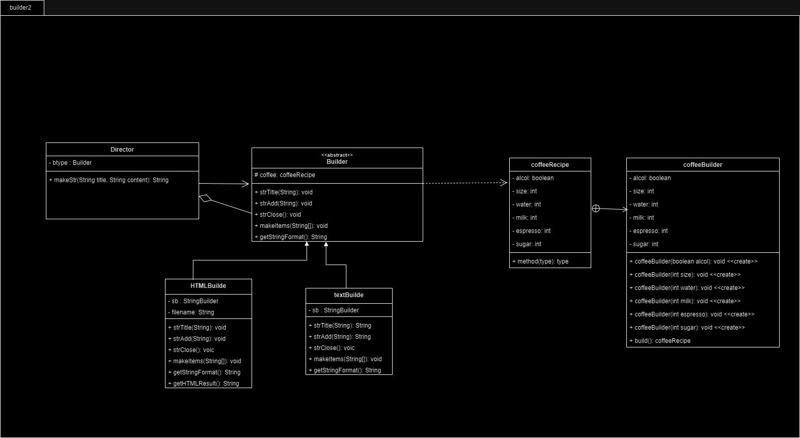
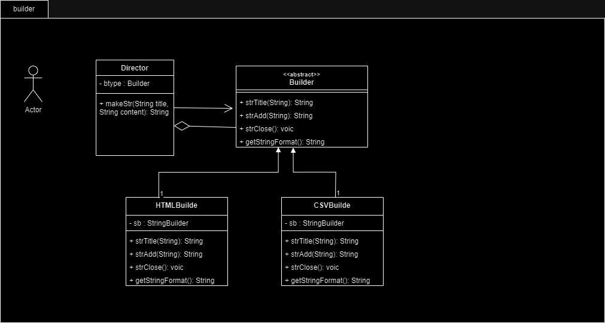
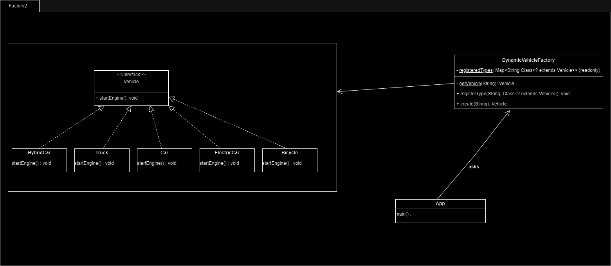
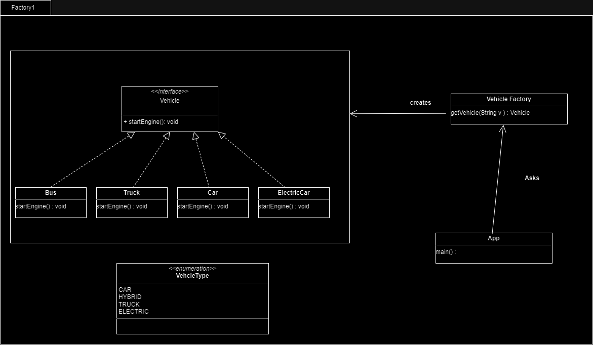

# 🙋디자인 패턴 소개 🙋

3가지 디자인패턴에 대해 소개하는 Docs 입니다. 

구현한 디자인패턴은 총 3가지로 BuilderPattern, FactoryPattern, State Pattern입니다. 

각각 수업 시간에 배웠던 기존의 예제에서 기능을 더하거나, 다른 디자인 패턴과 결합하여 사용하는 코드입니다. 

- 목차
    1. **Builder Pattern**
        1. 패턴 소개 
        2. 코드 소개 
        3. 개선 목표 
        4. 변화 
    2. **Factory Pattern**
        1. 패턴 소개 
        2. 코드 소개 
        3. 개선 목표 
        4. 변화 
    3. **State Pattern** 
        1. 패턴 소개 
        2. 코드 소개 
        3. 개선 목표 
        4. 해결방안
      
- 🐨 Javadoc 🐨
- 개별 pattern 별로 javadoc은 
1. builder Pattern : ./BuilderPattern/doc/java0825_builder2
2. factory Pattern : ./BuilderPattern/doc/FactoryPattern
3. State Pattern : ./State_Patter2/doc/statePattern-javadoc
   에 있습니다.
   개별 class 에 대한 세부 사항은 javadoc을 참고해주세요

## Builder Pattern

### 패턴 소개🧐

빌더 패턴(Builder Pattern)은 객체 생성을 단순화하고 가독성을 향상시키는 디자인 패턴 중 하나입니다.

### 코드 소개👻

코드 소개

Builder Method 패턴을 사용하여 Builder Pattern형식으로 구현한 객체를 다양한 형식의 문서 생성하는 코드입니다.  

아래 코드에서는 CSV와 HTML 형식의 문서를 생성하였으며, 이러한 형식을 쉽게 추가하거나 변경할 수 있습니다.(Open) Builder 패턴을 통해 객체 생성 및 설정 과정을 추상화하고, 가독성 높은 코드를 작성할 수 있습니다. 

- 

| 이름  | 설명  |
| --- | --- |
| Director | Builder 패턴을 사용하여 텍스트 형식의 문서를 생성하는 클래스 |
| Builder | 텍스트 타입의 구현 요구사항을 정의하는 추상 클래스 |
| coffeeRecipe | 커피 레시피 정보를 나타내는 클래스로, 커피의 알콜 유무 및 다양한 매개변수(크기, 우유 양, 에스프레소 양, 물 양, 설탕 양)를 설정 |
| coffeeBuilder | coffeeRecipe 객체를 생성하기 위한 빌더 클래스, coffeeRecipe의 내부 클래스 |
| User | 프로그램을 실행하는 클래스 입니다.  |
| HTMLBuilder | Builder를 상속받아 HTML 형식의 텍스트를 생성을 구현하는 클래스 |
| testBuilder | Builder를 상속받아 text 형식의 텍스트를 생성을 구현하는 클래스 |

주요 클래스에 대한 설명은 다음과 같습니다. 

1. **Builder 클래스**: 이 클래스는 추상 클래스로서, 다양한 형식의 문서를 생성하기 위한 메서드를 정의합니다. 각각의 구체적인 형식은 이 클래스를 상속하고 필요한 메서드를 구현하여 정의합니다. **`strTitle`**, **`strAdd`**, **`strClose`**, **`makeItems`**, **`getStringFormat`** 메서드를 포함합니다.
2. **coffeeRecipe 클래스**: 이 클래스는 커피 레시피 정보를 나타내는 클래스로, 커피의 알콜 유무 및 다양한 매개변수(크기, 우유 양, 에스프레소 양, 물 양, 설탕 양)를 설정할 수 있습니다. 빌더 패턴을 사용하여 생성됩니다.
3. **coffeeBuilder 클래스**: 커피Recipe 객체를 생성하기 위한 빌더 클래스입니다. 커피의 알콜 유무를 설정하고, 선택적으로 커피의 크기, 우유 양, 에스프레소 양, 물 양, 설탕 양을 설정할 수 있습니다.
4. **Director 클래스**: Builder 패턴을 사용하여 텍스트 형식의 문서를 생성하는 역할을 합니다. 특정 Builder 인스턴스를 받아서 해당 빌더를 사용하여 문서 생성 과정을 구체화합니다. **`construct`** 메서드는 문서 생성을 담당하고, **`makeStr`** 메서드는 문서를 생성하고 문자열 형태로 반환합니다.
5. **HTMLBuilder 클래스**: HTML 형식의 텍스트를 생성하는 구체적인 Builder 클래스로, HTML 문서의 제목과 항목 목록을 작성하는 메서드를 제공합니다.
6. **textBuilder 클래스**: CSV 형식의 텍스트를 생성하는 구체적인 Builder 클래스로, CSV 파일의 제목과 항목 목록을 작성하는 메서드를 제공합니다.
7. **User 클래스**: 프로그램의 진입점입니다. **`coffeeRecipe`** 객체를 생성하고, Builder 인스턴스를 생성하고, Director를 사용하여 다양한 형식의 문서를 생성하고 출력합니다.

### 개선 목표👁️

Builder Pattern의 또다른 형태인 

- 기존의 Builder Pattern에서 내가 원하는 객체의 내용을 받아 원하는 형식으로 Print하는 Buider 패턴을 구현

### 변화 ❤️

- coffeeRecipe 클래스 생성
    
    ```java
    public class coffeeRecipe {
        private boolean alcol;
        private int size;
        private int milk;
        private int espresso;
        private int water;
        private int sugar;
        public coffeeRecipe(coffeeBuilder coffeeBuilder) {
            this.alcol = coffeeBuilder.alcol;
            this.size = coffeeBuilder.size;
            this.milk = coffeeBuilder.milk;
            this.espresso = coffeeBuilder.espresso;
            this.water = coffeeBuilder.water;
            this.sugar = coffeeBuilder.sugar;
        }
    
    public static class coffeeBuilder {
            // 필수 매개 변수
            private final boolean alcol;
            // 선택 매개변수
            private int size = 0;
            private int milk = 0;
            private int espresso = 0;
            private int water = 0;
            private int sugar = 0;
    
            /**
             * 커피의 알콜 유무를 설정하는 coffeeBuilder 클래스의 생성자입니다.
             *
             * @param alcol 커피의 알콜 유무 (true 또는 false)
             */
            public coffeeBuilder(boolean alcol) {
                this.alcol = alcol;
            }
    ```
    
    |  | uml | 출력 내용 입력 방법  |
    | --- | --- | --- |
    | 전 |  | 직접 String을 생성하고, 넣어준다.  |
    | 후 |  | coffeeRecipe 를 생성 한 후, 해당 레시피를 출력한다.  |

coffeeRecipe 는 coffeeBuilder클래스를 내부 클래스 가집니다. 

이 클래스는 빌더 패턴을 사용하여 객체를 생성하므로, 객체를 생성할 때 다양한 속성을 설정할 수 있고, 가독성이 좋아지며, 객체의 불변성을 보장하고있습니다. 이를 통해 다양한 커피 레시피를 만들 수 있으며, 필요한 정보만 설정할 수 있습니다.

### 정리  🐾

Builder Pattern을 조합하여 얻은 장점은 다음과 같습니다. 

1. Open :객체의 생성 및 구성을 분리하여 유연성과 확장성을 제공합니다. 새로운 형식의 문서를 추가하거나 기존 형식을 변경하기 쉽습니다.
    1. 새로운 문서 형식을 다른 코드를 건드리지 않고 단순히 Builder 클래스를 상속받아 쉽게 생성할 수 있습니다. 
    2. Recipe에 새로운 인자가 추가될 경우, 기존의 코드를 건드리지 않고, 단순히 coffeeBuilder에만 추가해주면 됩니다. 
2. Close : 변경 가능성을 최소화할 수 있습니다. 
    1. StringBuilder를 private로 선언하여 외부에서 String을 건드리지 못합니다. 이는 내부 내용이 변경될 가능성을 낮춥니다. 
    2. coffeeRecipe에서 setter가 없음으로, 외부에서 내용을 변경할 수 없습니다. 

이러한 장점을 가진 Builder 패턴을 적절히 이용해야 합니다. 

## Factory Pattern

### 패턴 소개🧐

팩토리 패턴(Factory Pattern)은 객체지향 디자인 패턴 중 하나로, 객체를 생성하는 과정을 캡슐화하고 이를 통해 객체를 생성하는 인터페이스를 제공합니다. 이 패턴은 객체 생성과 객체 사용을 분리시켜 유연하고 확장 가능한 코드를 작성하는 데 도움을 줍니다.

팩토리 패턴은 주로 다음과 같은 상황에서 사용됩니다:

1. 객체 생성 과정이 복잡하거나 변경될 가능성이 있는 경우.
2. 객체 생성 로직을 여러 곳에서 반복해서 사용해야 하는 경우.
3. 객체 생성 과정을 추상화하고 클라이언트 코드와 분리하여 의존성을 낮추려는 경우.

이번 코드에서는 객체 생성 과정을 추상화하고, 클라이언트 코드와 분리하여 의존성을 낮추려는 경우를 구현했습니다. 

### 코드 소개👻

Factory Method 패턴을 사용하여 다양한 유형의 교통 수단(Vehicle) 객체를 생성하고 사용하는 예제. 입니다. Factory Method 패턴이란, 객체 생성을 캡슐화하고 서브클래스에서 객체 생성 방법을 결정하는 디자인 패턴입니다.
- uml


핵심 요소는 다음과 같습니다. 

1. **Vehicle 인터페이스**: **`Vehicle`** 인터페이스는 모든 차량 클래스가 구현해야 하는 메서드 **`startEngine()`**를 정의합니다. 이 인터페이스를 구현하는 클래스는 자신의 엔진을 시작하는 방법을 구체적으로 제공해야 합니다. 프로그램에서 **`Car`**, **`Truck`**, **`HybridCar`**, **`ElectricCar`**, 그리고 **`Bicycle`** 클래스가 이 인터페이스를 구현합니다.
2. **Vehicle 구현 클래스**: 다양한 차량 유형을 나타내는 클래스들이 **`Vehicle`** 인터페이스를 구현합니다. 예를 들어, **`Car`**, **`Truck`**, **`HybridCar`**, **`ElectricCar`**, 그리고 **`Bicycle`** 클래스들은 각각 자신의 엔진을 시작하는 방법에 대한 구현을 제공합니다.
3. **DynamicVehicleFactory 클래스**: 이 클래스는 Factory Method 패턴을 구현하는 핵심 클래스입니다. 다양한 차량 객체를 동적으로 생성하고 등록하는 기능을 제공합니다.
    - **`registeredTypes`**라는 **`Map`**을 사용하여 차량 유형과 그에 해당하는 클래스를 관리합니다. 초기에는 "Car", "Truck", "ElectricCar" 등의 차량 유형이 미리 등록되어 있습니다.
    - **`registerType(String type, Class<? extends Vehicle> cls)`** 메서드를 사용하여 새로운 차량 유형과 해당 클래스를 등록할 수 있습니다.
    - **`create(String type)`** 메서드는 주어진 차량 유형에 해당하는 차량 객체를 생성합니다. Reflection을 사용하여 클래스를 인스턴스화하고 엔진을 시작하는 **`startEngine()`** 메서드를 호출한 후 객체를 반환합니다.
4. **App 클래스**: 이 클래스는 프로그램의 진입점을 제공합니다. 다음과 같은 작업을 수행합니다:
    - 미리 등록된 차량 유형인 "Car"와 "Truck"의 객체를 생성하고 엔진을 시작합니다.
    - 동적으로 "Bicycle" 차량 유형을 등록하고 이에 해당하는 객체를 생성하고 엔진을 시작합니다.

| 이름 | 설명 |
| --- | --- |
| Vehicle | 차량을 나타내는 인터페이스 |
| DynamicVehicleFactory |  동적으로 다양한 차량(Vehicle) 객체를 생성하는 팩토리 클래스
* Reflection을 사용하여 등록된 차량 타입에 따라 객체를 생성합니다.
* 새로운 차량 타입을 등록하고 차량 객체를 생성하는 기능을 제공 |
| App | 동작 테스트 용 클래스  |
| Bicycle | vehicle의 구현 클래스 |
| Car | vehicle의 구현 클래스 |
| ElectricCar | vehicle의 구현 클래스 |
| HybridCar | vehicle의 구현 클래스 |
| Truck | vehicle의 구현 클래스 |

### 개선 목표👁️

팩토리 메서드 패턴의 큰 단점은 제품 객체의 갯수마다 공장 서브 클래스를 모두 구현해야되서 클래스 폭발이 일어날수 있다는 점입니다. 이를 Reflection API를 이용해 동적으로 처리하여 서브 클래스 폭발을 막는 패턴입니다. 기존에 수업시간에 Enum을 활용하여 폭발적으로 코드를 생성해야하는 문제를 해결했지만, Enum 객체는 상속이 불가능하다는 한계가 존재한다. 

따라서, 자바의 클래스를 이용하여 동적으로 등록하고 인스턴스를 초기화하는 Dynamic Factory Pattern을 통해 구현한다. 이를 통해 팩토리 매서드의 서브 클래싱 부피가 늘어나는 한계를 극복하는 것을 목표로 한다.  특히, 동적으로 객체를 생성함으로 유연성을 확보할 수 있을 것 입니다.

### 변화 ❤️

|  | uml | class 추가 생성 방법  |
| --- | --- | --- |
| 전 |  | Calss 생성 후, Enum을 수정한다.  |
| 후 |  | 클래스를 추가한 후, DynamicVehicleFactory에 registerVehicle 함수를 통해 Factory에 등록한다.  |

이전, 후 공통적으로 Vehicle interface를 상속받아 vehicle의 종류들을 직접적으로 구현하면서 구현부와 정의부를 나눴습니다. 이는 템플릿을 통해 상위클래스만 보고도 하위 클래스가 어떻게 처리되는 지 알 수 있다는 장점을 습니다. 

### 정리  🐾

이를 통해 얻은 장점은 다음과 같습니다. 

1. User 는 객체 생성에 직접적으로 관여할 수 없습니다. (Closed) 
2. 기존의 코드를 변경하지 않고, 새로운 객체를 생성하고 통합할 수 있습니다. 또한 동적으로 런타임 중에 클래스의 인스턴스를 생성할지 결정할 수 있습니다 (Open)
3. 객체 생성 로직을 여러 곳에서 중복으로 하지 않아 코드 중복을 최소화했습니다. 

## State Pattern

### 패턴 소개🧐

상태 패턴의 주요 특징 및 장점은 다음과 같습니다. 

- 상태 패턴은 상태 전이에 따른 복잡한 조건문을 방지하고, 객체의 상태와 관련된 코드를 분리하여 유지보수성을 향상시킵니다.
- 객체의 상태를 클래스로 표현하므로 새로운 상태를 추가하거나 기존 상태를 수정하기가 용이합니다.
- 컨텍스트와 상태 클래스 간의 의존성이 줄어들어 객체 간의 결합도를 낮추고 확장성을 높입니다.
- 코드의 가독성을 높이고 오류를 줄일 수 있습니다.

예를 들어, 아침, 점심, 야간에 따라 경비 시스템의 역할이 달라질 경우, 상황(State)에 따라 다른 메소드를 구현할 수 있게 할 수 있습니다. 

### 코드 소개👻

상태 패턴(State Pattern)을 활용하여 시간에 따라 동작이 변경되는 시계 애플리케이션을 구현한 예제입니다. 각 상태를 Hours에 Enum으로 저장하고, Enum과 HashMap을 사용하여 SafeFrame에서 Key(시간)값으로 상태를 찾아 변화시킬 수 있도록합니다. 

- UML
    - <./StatePattern!.drawio.png>
        
        
        | 이름 | 설명 |
        | --- | --- |
        | Context | State와 상호작용하는 메소드를 정의한 인터페이스 |
        | Hours | 간대와 해당하는 상태(State)를 매핑하는 역할을 하는 Enum |
        | SafeRame | Context를 구현한 프레임(Frame) 클래스 |
        | State | 상태(State) 클래스가 구현해야 하는 메서드를 정의하는 인터페이스 |
        | DayState | 주간 상태를 나타내는 구현 클래스 |
        | LunchState | 점심 상태를 나타내는 구현 클래스 |
        | NightState | 야간 상태를 나타내는 구현 클래스 |

주요 클래스는 다음과 같습니다. 

이 프로그램은 상태 패턴(State Pattern)을 사용하여 시계 애플리케이션을 구현한 것으로, 다음과 같은 주요 클래스와 함수를 포함합니다.

1. **`Context`** 인터페이스:
    - **`setClock(int hour)`**: 시간을 설정하고 현재 시간에 따라 상태를 변경하는 메서드입니다.
    - **`changeState(State state)`**: 상태를 변경하는 메서드로, 새로운 상태를 받아와 현재 상태를 변경합니다.
    - **`callSecurityCenter(String msg)`**: 보안 센터에 메시지를 호출하는 메서드입니다.
    - **`recordLog(String msg)`**: 로그를 기록하는 메서드입니다.
2. **`DayState`** 클래스:
    - **`getInstance()`**: DayState의 인스턴스를 반환하는 정적 메서드로, 싱글톤 패턴을 구현합니다.
    - **`doClock(Context context, State newState)`**: 시간대에 따라 상태 변경을 처리하는 메서드입니다.
    - **`doUse(Context context)`**: 주간 시간에 금고 사용을 처리하는 메서드입니다.
    - **`doAlarm(Context context)`**: 주간 시간에 발생한 알람을 처리하는 메서드입니다.
    - **`recordPhone(Context context)`**: 주간 시간에 발생한 전화 기록을 처리하는 메서드입니다.
    - **`toString()`**: 객체를 문자열로 반환하는 메서드로, 현재 상태를 나타내는 문자열을 반환합니다.
3. **`Hours`** 열거형:
    - 시간대(Time of Day)와 각 시간대에 해당하는 상태(State)를 매핑하는 역할을 합니다.
    - **`getState()`**: 상태를 반환하는 추상 메서드로, 시간대별로 해당하는 상태 객체(State)를 반환합니다.
4. **`LunchState`** 클래스:
    - **`getInstance()`**: LunchState의 인스턴스를 반환하는 정적 메서드로, 싱글톤 패턴을 구현합니다.
    - **`doClock(Context context, State newState)`**: 시간대에 맞는 상태로 변경하는 메서드입니다.
    - **`doUse(Context context)`**: 시간대에 맞는 금고 사용을 처리하는 메서드입니다.
    - **`doAlarm(Context context)`**: 시간대에 맞는 알람을 처리하는 메서드입니다.
    - **`recordPhone(Context context)`**: 시간대에 맞는 통화 기록을 처리하는 메서드입니다.
    - **`toString()`**: 객체를 문자열로 반환하는 메서드로, 현재 상태를 나타내는 문자열을 반환합니다.
5. **`Main`** 클래스:
    - 상태 패턴을 활용하여 시계 애플리케이션을 실행하는 메인 클래스입니다.
    - **`main(String[] args)`**: 프로그램의 진입점으로, 시간을 주기적으로 업데이트하면서 상태를 변경합니다.
6. **`NightState`** 클래스:
    - **`getInstance()`**: NightState의 인스턴스를 반환하는 정적 메서드로, 싱글톤 패턴을 구현합니다.
    - **`doClock(Context context, State newState)`**: 시간대에 따라 상태 변경을 처리하는 메서드입니다.
    - **`doUse(Context context)`**: 야간 시간에 금고 사용을 처리하는 메서드입니다.
    - **`doAlarm(Context context)`**: 야간 시간에 발생한 알람을 처리하는 메서드입니다.
    - **`recordPhone(Context context)`**: 야간 시간에 발생한 전화 기록을 처리하는 메서드입니다.
    - **`toString()`**: 객체를 문자열로 반환하는 메서드로, 현재 상태를 나타내는 문자열을 반환합니다.
7. **`SafeFrame`** 클래스:
    - Context 역할을 하는 프레임(Frame) 클래스로, 금고의 현재 상태를 표시하고 사용자의 입력을 처리합니다.
    - **`setClock(int hour)`**: 현재 시간을 화면에 표시하고 상태를 변경합니다.
    - **`changeState(State state)`**: 상태를 변경하는 메서드로, 현재 상태를 변경합니다.
    - **`callSecurityCenter(String msg)`**: 보안 센터에 메시지를 호출하는 메서드입니다.
    - **`recordLog(String msg)`**: 로그를 기록하는 메서드입니다.
    - **`actionPerformed(ActionEvent e)`**: 사용자 입력을 처리하는 메서드로, 버튼 클릭 등의 이벤트에 따라 동작을 수행합니다.
    - **`makeMap(int i)`**: 시간대에 따른 상태 정보를 담은 HashMap을 생성하는 메서드입니다.
8. **`State`** 인터페이스:
    - 각 상태 클래스가 구현해야 하는 메서드를 정의하는 인터페이스로, 시계 시간, 금고 사용, 비상벨, 일반 통화에 대한 처리 메서드를 정의합니다.

이러한 클래스와 함수들을 조합하여 시계 애플리케이션을 구현하고, 시간에 따라 다양한 동작을 수행하도록 되어 있습니다.

### 개선 목표👁️

교안의 State Pattern은 State가 늘어남에 따라 If 구문을 늘려감으로 비효율이 발생했다. 

이를 해결하기 위해 State를 저장한 Enum과 HashMap을 활용하여 database에 등록한 것과 같은 효과를 내어 hour만 안다면 바로 시간에 따라 State를 변경하는 코드를 작성했다. 

하지만 기존 코드가 가진 비효율 문제 2가지를 해결하고자 한다. 

1. Hash Map을 Main에서 직접 초기화하여 코드가 지저분해진다. 따라서 초기화 하는 함수를 구현해주도록 한다. 
    
    기존의 비효율 적인 코드는 다음과 같다. 
    

```java
public static void main(String[] args) {
	    // 시간대에 따른 상태를 매핑하는 HashMap을 생성합니다.
		HashMap<Integer , Hours> timeMap = new HashMap<>();
		timeMap.put(0, Hours.NIGHT_STATE);
		timeMap.put(1, Hours.NIGHT_STATE);
		timeMap.put(2, Hours.NIGHT_STATE);
		timeMap.put(3, Hours.NIGHT_STATE);
		timeMap.put(4, Hours.NIGHT_STATE);
		timeMap.put(5, Hours.NIGHT_STATE);
		timeMap.put(6, Hours.NIGHT_STATE);
		timeMap.put(7, Hours.NIGHT_STATE);
		timeMap.put(8, Hours.DAY_STATE);
		timeMap.put(9, Hours.DAY_STATE);
		timeMap.put(10, Hours.DAY_STATE);
		timeMap.put(11, Hours.LUNCH_STATE);
		timeMap.put(12, Hours.LUNCH_STATE);
		timeMap.put(13, Hours.DAY_STATE);
		timeMap.put(14, Hours.DAY_STATE);
		timeMap.put(15, Hours.DAY_STATE);
		timeMap.put(16, Hours.DAY_STATE);
		timeMap.put(17, Hours.DAY_STATE);
		timeMap.put(18, Hours.NIGHT_STATE);
		timeMap.put(19, Hours.NIGHT_STATE);
		timeMap.put(20, Hours.NIGHT_STATE);
		timeMap.put(21, Hours.NIGHT_STATE);
		timeMap.put(22, Hours.NIGHT_STATE);
```

1. Hash Map을 직접적으로 사용하는 Safe Frame이 map을 가지고 있지 않기 때문에 논리적으로 맞지 않는다. 따라서 timeMap을 SafeFrame이 객체로 가질 수 있게 한다. 

### 해결 방안 👁️ ❤️

1. Safe frame에서 makeMap 함수를 통해 해시맵을 초기화해준다. 
    
    구현한 코드는 다음과 같다. 
    
    함수를 통해 시간대별로 map을 만들어 주는 것이가능하다. 
    
    이후 State가 추가된다면 State 의 클래스를 추가로 만들어 주고, 해당 init 함수에서 시간대를 고쳐 초기화 해주면 된다. 이를 통해 코드를 쉽게 추가/ 삭제할 수 있어 Open원칙을 획득한다. 
    
    이전에 시간이 변할 때마다 if 를 통해 시간에 따른 상태를 체크했던 것 과 달리, makeMap은 프로그램을 시작할 때 한번만 if를 통해 초기화하면 되기 때문에 이전과 달리 효율을 높인 것이다. 
    

```java
public HashMap<Integer, Hours> makeMap(int i) {
        HashMap<Integer, Hours> mapinit = new HashMap<>();
        for (int j = 0; j < i; j++) {
            if (j >= 11 && j <= 12) {
                mapinit.put(j, Hours.LUNCH_STATE);
                continue;
            } else if (j >= 8 && j <= 17) {
                mapinit.put(j, Hours.DAY_STATE);
            } else mapinit.put(j, Hours.NIGHT_STATE);
        }
        return mapinit;
    }
```

1. Safe Frame에서 make Map을 매개변수로 가지고 있어, 해당 함수 내에서 사용할 수 있게 해준다. 

```java
private static HashMap<Integer, Hours> timeMap = new HashMap<Integer, Hours>();
```

이때, private static으로 선언해주어 후에 외부에서 timeMap을 변경할 수 없도록 한다. 이는 디자인 패턴의 Open & Closed 원칙을 지키기 위해 필요하다. 외부에서 접근할 수 없게 함으로 보안을 강화한다. (Closed) 

### 정리   🐾

해당 변경을 통해 얻은 장점은 다음과 같습니다. 

1. 변경 가능성 최소화 (Close) 
    1. 사용자가 map을 변경할 수 없도록 하여 timeMap에 대한 변경 가능성을 최소화합니다. 
2. 역할 분리
    1. SafeFrame에서 map을 초기화하고, 변수로 가지고 있음을 통해서 역할에 따른 분리가 되었습니다. 
    2. 이를 객체의 역할을 명확히 하여 추후 코드의 수정 시 수정할 부분을 빠르게 선정할 수 있습니다.
