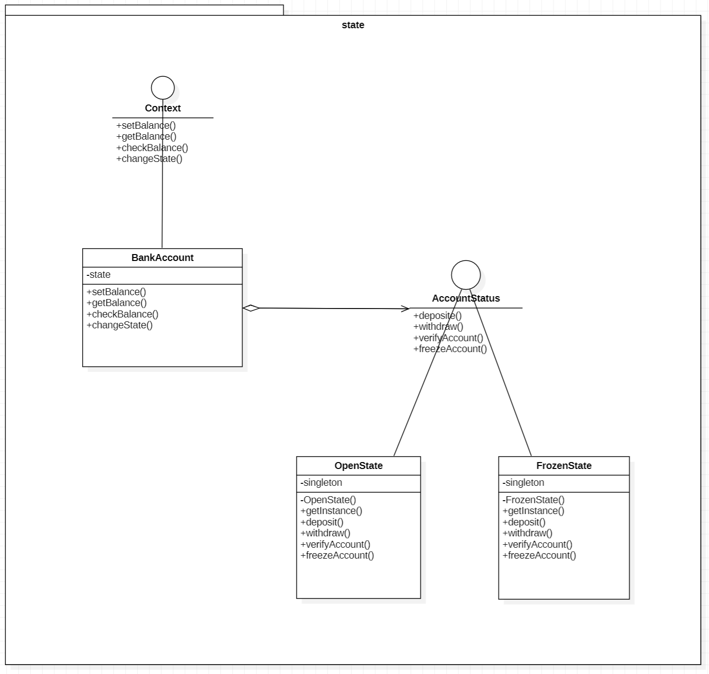
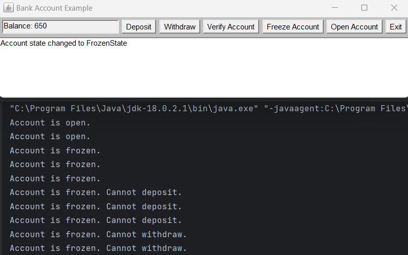
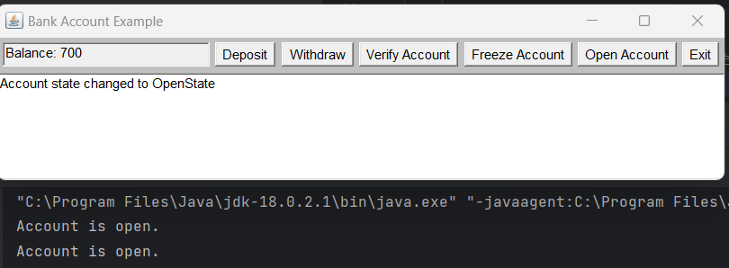

# State 패턴 

## State 패턴 소개

- State 패턴은 객체의 상태를 관리하고 해당 상태에 따라 객체의 행동을 변경하는 디자인 패턴입니다.
- 이 패턴을 사용하면 객체의 상태 전이를 캡슐화하고, 유지보수와 확장이 쉬운 구조를 만들 수 있습니다.

## 사용 이유

- 객체가 여러 상태에 따라 다른 행동을 해야 할 때 State 패턴을 사용하면 코드 유지보수가 용이하며 가독성이 높아집니다.

## 장점

- 코드의 가독성과 유지보수성이 향상됩니다.
- 객체의 상태 전이를 명확하게 관리할 수 있습니다.

## 단점

- 상태 클래스가 많아질수록 클래스의 수가 늘어날 수 있습니다.

## 스토리

이 예제는 은행 계좌의 상태를 관리하는 패턴을 구현한 것입니다. 계좌는 두 가지 상태를 가집니다.

1. **열린 상태 (Open State):** 입금과 출금이 가능합니다.
2. **동결된 상태 (Frozen State):** 입금과 출금이 불가능하며, 계좌 확인과 상태 변경만 가능합니다.

## State 패턴 UML 다이어그램

- **Context 인터페이스:** 계좌 상태를 관리하는 메소드를 정의합니다.
    - `setBalance()`: 계좌 잔액 설정
    - `getBalance()`: 계좌 잔액 조회
    - `checkBalance()`: 계좌 확인
    - `changeState()`: 계좌 상태 변경
- **BankAccount 클래스:** Context 인터페이스를 구현하여 은행 계좌를 표현하고 GUI로 상태 관리를 합니다.
- **AccountStatus 인터페이스:** 계좌의 동작을 정의하는 메소드를 선언합니다.
    - `deposit()`: 입금
    - `withdraw()`: 출금
    - `verifyAccount()`: 계좌 확인
    - `freezeAccount()`: 계좌 동결
- **OpenState 클래스:** "열린 상태"를 나타냅니다. 입금, 출금, 계좌 확인, 계좌 동결 메소드를 구현합니다.
- **FrozenState 클래스:** "동결된 상태"를 나타냅니다. 입금과 출금 메소드는 동작하지 않으며, 계좌 확인과 계좌 동결 메소드만 가능합니다.

## 실행 결과

### Frozen State

- 계좌가 동결된 상태입니다. Deposit와 Withdraw가 불가능합니다.
- VerifyAccount: 계좌 상태를 확인할 수 있습니다.
- OpenAccount: 계좌를 열린 상태로 변경할 수 있습니다.

### Open State

- 계좌가 열린 상태입니다. Deposit와 Withdraw가 가능합니다.
- VerifyAccount: 계좌 상태를 확인할 수 있습니다.
- FreezeAccount: 계좌를 동결 상태로 변경할 수 있습니다.
