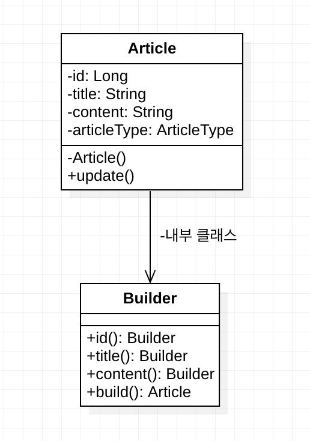
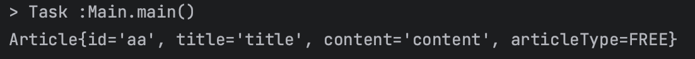
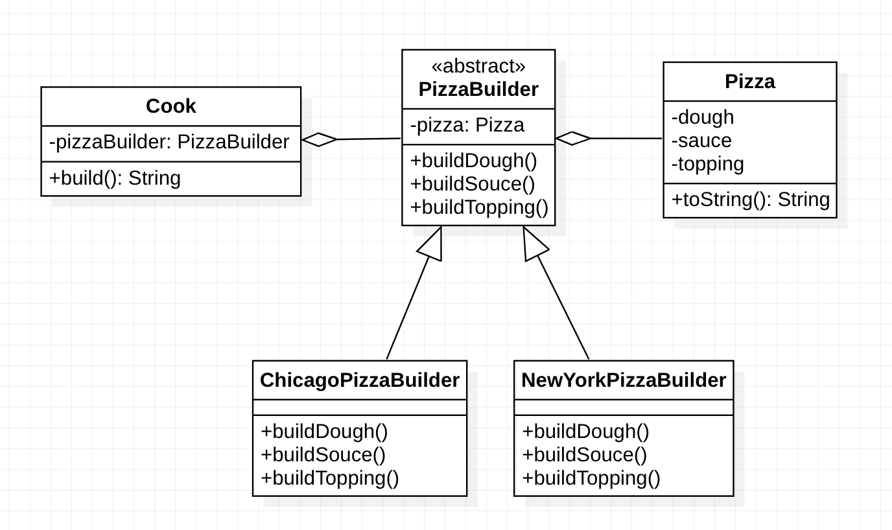
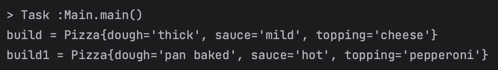

# 빌더 패턴 (Builder Pattern)

## 개요
디렉터 빌더 패턴(GOF)을 처음 접하고 기존에 내가 알던 lombok의 `@Builder`를 이용해 객체를 생성하는 방식과 달라 생소하게 느껴졌다.
알고보니 lombok의 빌더 패턴은 심플 빌더 패턴으로 이펙티브 자바 스타일의 빌더 패턴을 더 쉽게 사용할 수 있도록 고안된 것이라고 한다.

하지만 이 두 방식 모두 복잡한 객체의 생성과정과 표현 방법을 분리하여 다양한 구성의 인스턴스를 만드는 것을 목적으로 한 데에는 동일하다.
지금부터 빌더 패턴을 적용하기 전 코드를 보고 두가지 방식의 빌더패턴을 적용한 코드를 확인해보자. 

## Before
```java
public class Article {
    // final 키워드로 필드들을 불변 객체로 만든다.
    private String id;
    private String title;
    private String content;
    private ArticleType articleType;
    
    public Article(String id, String title, String content, ArticleType articleType) {
        this.id = id;
        this.title = title;
        this.content = content;
        this.articleType = articleType;
    }

    public Article(String id, String title, String content) {
        this.id = id;
        this.title = title;
        this.content = content;
    }
    
    public Article(String id, String title) {
        this.id = id;
        this.title = title;
    }
  
    ...
}
```
위와 같이 생성자를 오버로딩해 다양한 매개변수를 입력받는 형식으로 인스턴스를 생성한다.
하지만 이러한 방식은 클래스 인스턴스 필드들이 많으면 많을 수록 생성자에 들어갈 인자의 수가 늘어나 몇번째 인자가 어떤 필드였는지 햇갈릴 경우가 생기게 된다.
무엇보다 타입이 다양할 수록 생성자 메서드 수가 기하급수적으로 늘어나 가독성이나 유지보수 측면에서 좋지 않다.

---

## Effective Java Builder Pattern(심플 빌더 패턴)
보통 개발자들이 빌더 패턴을 말할 때 정의되는 것이 이펙티브 자바에서 소개한 빌더 패턴이다. 
GOF 빌더 패턴과 구분하기 위해 심플 빌더 패턴(Simple Builder Pattern) 이라고도 불린다.

심플 빌더 패턴은 생성자가 많을 경우 또는 변경 불가능한 불변 객체가 필요한 경우 코드의 가독성과 일관성, 불변성을 유지하는 것에 중점을 둔다.

### 다이어그램


- 게시글을 의미하는 Article 엔티티이다.
- 게시글은 식별자(id)와 제목(title), 내용(content), 게시글종류(articleType)을 가진다. 
- 생성자는 private으로 선언되어 빌더를 통해서만 인스턴스가 생성되게 구현한다.
- 내부 Builder 클래스를 static 으로 선언해주어야 한다. 
  - 만일 일반 내부 클래스로 구성한다면 내부 클래스를 생성하기도 전에 외부 클래스를 인스턴스화 해야 한다. 
  빌더가 최종적으로 생성할 클래스의 인스턴스를 먼저 생성해야 한다면 모순이 생기기 때문이다.

### 구현 코드
```java
/**
 * 이 클래스는 게시글(Article) 정보를 나타내는 클래스입니다. 불변 객체로 설계되었으며, 빌더 패턴을 사용하여 객체를 생성합니다.
 */
public class Article {
    // final 키워드로 필드들을 불변 객체로 만든다.
    private final String id;
    private final String title;
    private final String content;
    private final ArticleType articleType;

    /**
     * Article 객체를 생성하기 위한 정적 내부 빌더 클래스입니다.
     */
    public static class Builder {

        // 필수 파라미터
        private final String id;
        private final String title;
        private final ArticleType articleType;

        // 선택 파라미터
        private String content;

        /**
         * 필수 파라미터를 받는 빌더 클래스의 생성자입니다.
         *
         * @param id          게시글 식별자
         * @param title       게시글 제목
         * @param articleType 게시글 유형
         */
        public Builder(String id, String title, ArticleType articleType) {
            this.id = id;
            this.title = title;
            this.articleType = articleType;
        }

        /**
         * 게시글 내용을 설정하는 메서드입니다.
         *
         * @param content 게시글 내용
         * @return 빌더 객체 자신을 반환하여 메서드 체이닝 지원
         */
        public Builder content(String content) {
            this.content = content;
            return this;
        }

        /**
         * Article 객체를 생성합니다.
         *
         * @return 생성된 Article 객체
         */
        public Article build() {
            return new Article(this); // 빌더 객체 자신을 넘깁니다.
        }
    }

    // private 생성자 - 생성자는 외부에서 호출되는 것이 아닌 빌더 클래스에서만 호출되기 때문에
    private Article(Builder builder) {
        this.id = builder.id;
        this.title = builder.title;
        this.content = builder.content;
        this.articleType = builder.articleType;
    }

    @Override
    public String toString() {
        return "Article{" +
                "id='" + id + '\'' +
                ", title='" + title + '\'' +
                ", content='" + content + '\'' +
                ", articleType=" + articleType +
                '}';
    }
}

```

### 구현 방법
- 빌더 클래스를 Static Nested Class로 정의한다.
- 빌더를 통해 인스턴스화 하기 때문에 대상 객체 생성자는 private로 정의한다.
- 빌더 클래스의 생성자는 public으로 하며, 필수 파라미터에 대해 생성자의 파라미터로 받는다.
- 선택적 파라미터에 대해서는 메소드로 제공한다. 이때 메소드의 반환값은 빌더 객체 자신(this) 이어야 한다.
- 마지막 단계로 최종 객체를 생성하는 build() 메소드를 정의하여 클라이언트에게 최종 생성된 결과물을 제공한다.
- 이때 생성자의 인수로 빌더 인스턴스 자기자신을 전달하고, 대상 객체 생성자에서 빌더 인스턴스의 필드를 각각 대입하여 최종 완성본이 나오게 된다.

### 확인코드
```java
/**
 * 이 클래스는 `Article` 클래스의 빌더 패턴을 사용하여 게시글 객체를 생성하고 출력하는 메인 클래스입니다.
 */
public class Main {
    /**
     * 메인 메서드에서는 `Article` 클래스의 빌더를 사용하여 게시글 객체를 생성하고 출력합니다.
     *
     * @param args 커맨드 라인 인자 (사용하지 않음)
     */
    public static void main(String[] args) {
        // Article 빌더를 사용하여 게시글 객체를 생성합니다.
        Article build = new Article.Builder("aa", "title", ArticleType.FREE)
                .content("content")
                .build();

        // 생성된 게시글 객체를 출력합니다.
        System.out.println(build);
    }
}

```
### 결과



Article의 Builder를 사용해 Article 인스턴스인 build가 생성된 것을 알 수 있다. 

---

## Lombok의 @Builder를 이용한 심플 빌더 패턴
심플 빌더패턴을 Lombok의 Annotation을 이용해 쉽게 구현할 수 있다.

```java
@AllArgsConstructor
@Builder
public class ArticleLombok {
    private final String id;
    private final String title;
    private final String content;
    private final ArticleType articleType;
}

```
구현하고자 하는 엔티티에 생성자와 @Builder annotation을 붙여주면 알아서 Builder 를 생성해준다.
```java
ArticleLombok articleLombok = ArticleLombok.builder()
        .id("bb")
        .title("title2")
        .content("content2")
        .articleType(ArticleType.FREE)
        .build();
```
Article의 Builder를 직접 구현한 것과 동일한 방식으로 사용이 가능하다.

---

## Director Builder Pattern (GOF)
GOF에서 정의하고 있는 디자인 패턴은 복잡한 객체의 생성 알고리즘과 조립 방법을 분리하여 빌드 공정을 구축하는것이 목적이다. 빌더를 받아 조립 방법을 정의한 클래스를 Director라고 부른다.

심플 빌더 패턴은 하나의 대상 객체에 대한 생성만을 목적을 두지만, 디렉터 빌더 패턴은 여러가지의 빌드 형식을 유연하게 처리하는 것에 목적을 둔다. 어찌보면 일반적인 빌더 패턴을 고도화 시킨 패턴이라고 볼 수 도 있다.
### 다이어그램


- PizzaBuilder : 빌더 추상 클래스 (Builder 클래스)
- ChicagoPizzaBuilder, NewYorkPizzaBuilder : Builder의 구현체. Product 생성을 담당한다. 각각 Pizza 인스턴스르 chicago pizza, newyork pizza로 만든다.
- Cook : Builder에서 제공하는 메서드들을 사용해 정해진 순서대로 Product 생성하는 프로세스를 정의 (Director 클래스)
- Pizza : Director가 Builder로 만들어낸 결과물.

### 구현 코드
```java

/**
 * 이 클래스는 피자 객체를 나타내는 클래스입니다.
 */
public class Pizza {
    /**
     * 피자의 도우 종류를 나타내는 문자열입니다.
     */
    private String dough;

    /**
     * 피자의 소스 종류를 나타내는 문자열입니다.
     */
    private String sauce;

    /**
     * 피자의 토핑 종류를 나타내는 문자열입니다.
     */
    private String topping;

    /**
     * 피자 객체의 문자열 표현을 반환합니다.
     *
     * @return 피자 객체의 문자열 표현
     */
    @Override
    public String toString() {
        return "Pizza{" +
                "dough='" + dough + '\'' +
                ", sauce='" + sauce + '\'' +
                ", topping='" + topping + '\'' +
                '}';
    }
}
```
```java

/**
 * 이 추상 클래스는 피자 객체를 생성하는 빌더 패턴의 기반 클래스입니다.
 */
@Getter
public abstract class PizzaBuilder {
    /**
     * 생성되는 피자 객체를 나타내는 인스턴스 변수입니다.
     */
    protected Pizza pizza;

    /**
     * PizzaBuilder 객체를 생성할 때 주입받은 피자 객체를 사용하여 초기화합니다.
     *
     * @param pizza 생성할 피자 객체
     */
    public PizzaBuilder(Pizza pizza) {
        this.pizza = pizza;
    }

    /**
     * 피자의 도우를 빌드하는 추상 메서드입니다.
     */
    public abstract void buildDough();

    /**
     * 피자의 소스를 빌드하는 추상 메서드입니다.
     */
    public abstract void buildSource();

    /**
     * 피자의 토핑을 빌드하는 추상 메서드입니다.
     */
    public abstract void buildTopping();
}


```

```java

/**
 * 이 클래스는 시카고 피자 스타일을 생성하기 위한 피자 빌더 클래스입니다.
 * PizzaBuilder를 상속하여 시카고 피자의 도우, 소스, 토핑을 빌드합니다.
 */
public class ChicagoPizzaBuilder extends PizzaBuilder {

    /**
     * ChicagoPizzaBuilder 객체를 생성할 때 주입받은 피자 객체를 사용하여 초기화합니다.
     *
     * @param pizza 생성할 피자 객체
     */
    public ChicagoPizzaBuilder(Pizza pizza) {
        super(pizza);
    }

    /**
     * 시카고 피자의 도우를 빌드합니다.
     */
    @Override
    public void buildDough() {
        pizza.setDough("thick");
    }

    /**
     * 시카고 피자의 소스를 빌드합니다.
     */
    @Override
    public void buildSource() {
        pizza.setSauce("mild");
    }

    /**
     * 시카고 피자의 토핑을 빌드합니다.
     */
    @Override
    public void buildTopping() {
        pizza.setTopping("cheese");
    }
}
```

```java

/**
 * 이 클래스는 뉴욕 피자 스타일을 생성하기 위한 피자 빌더 클래스입니다.
 * PizzaBuilder를 상속하여 뉴욕 피자의 도우, 소스, 토핑을 빌드합니다.
 */
public class NewYorkPizzaBuilder extends PizzaBuilder {

    /**
     * NewYorkPizzaBuilder 객체를 생성할 때 주입받은 피자 객체를 사용하여 초기화합니다.
     *
     * @param pizza 생성할 피자 객체
     */
    public NewYorkPizzaBuilder(Pizza pizza) {
        super(pizza);
    }

    /**
     * 뉴욕 피자의 도우를 빌드합니다.
     */
    @Override
    public void buildDough() {
        pizza.setDough("pan baked");
    }

    /**
     * 뉴욕 피자의 소스를 빌드합니다.
     */
    @Override
    public void buildSource() {
        pizza.setSauce("hot");
    }

    /**
     * 뉴욕 피자의 토핑을 빌드합니다.
     */
    @Override
    public void buildTopping() {
        pizza.setTopping("pepperoni");
    }
}

```

```java
/**
 * 이 클래스는 피자 빌더를 사용하여 피자를 조리하는 역할을 하는 클래스입니다.
 */
@Getter
public class Cook {
    /**
     * 사용할 피자 빌더를 나타내는 멤버 변수입니다.
     */
    private PizzaBuilder pizzaBuilder;

    /**
     * Cook 객체를 생성할 때 주입받은 피자 빌더를 사용하여 초기화합니다.
     *
     * @param pizzaBuilder 사용할 피자 빌더
     */
    public Cook(PizzaBuilder pizzaBuilder) {
        this.pizzaBuilder = pizzaBuilder;
    }

    /**
     * 주어진 피자 빌더를 사용하여 피자를 빌드하고 그 결과를 문자열로 반환합니다.
     *
     * @return 빌드된 피자 정보를 나타내는 문자열
     */
    public String build() {
        pizzaBuilder.buildDough();
        pizzaBuilder.buildSource();
        pizzaBuilder.buildTopping();

        return pizzaBuilder.getPizza().toString();
    }
}
```

### 확인 코드
```java
/**
 * 이 클래스는 피자 빌더 패턴을 사용하여 다양한 지역 스타일의 피자를 생성하고 출력하는 메인 클래스입니다.
 */
public class Main {
    /**
     * 메인 메서드에서는 ChicagoPizzaBuilder와 NewYorkPizzaBuilder를 사용하여 피자를 빌드하고 출력합니다.
     *
     * @param args 커맨드 라인 인자 (사용하지 않음)
     */
    public static void main(String[] args) {
        Pizza pizza = new Pizza();

        PizzaBuilder chicagoPizza = new ChicagoPizzaBuilder(pizza);
        Cook cook1 = new Cook(chicagoPizza);
        String pizza1 = cook1.build();
        System.out.println("pizza1 = " + pizza1);

        PizzaBuilder newyorkPizza = new NewYorkPizzaBuilder(pizza);
        Cook cook2 = new Cook(newyorkPizza);
        String pizza2 = cook2.build();
        System.out.println("pizza2 = " + pizza2);
    }
}
```

### 결과


위에서 작성한 예제를 기준으로 Main 클래스는 Builder 클래스의 메소드를 모르고 호출하지도 않는다.

단지, Cook 클래스(:Director클래스)의 build() 메소드만을 호출한다. 그럼 Cook 클래스 안에서 로직이 수행되고 피자가 완성된다.

한편, Cook 클래스는 Builder() 클래스를 알고 있고 Builder 클래스의 메소드를 사용해서 피자를 만들지만, 자신이 실제로 이용하는 클래스가 ChicagoPizzaBuilder 인지, NewYorkPizzaBuilder 인지 모른다.

이처럼 Cook 클래스가 자신이 이용하고 있는 Builder 클래스의 하위 클래스를 모르기 때문에 교체가 가능하다.

---
## 빌더 패턴의 장단점

#### 장점
- 객체 생성 과정을 일관된 프로세스로 표현할 수 있다.
- 같은 빌더를 사용하여 여러 개의 객체를 생성함으로써 인해 중복 코드를 피할 수 있다.
- 빌더 메서드를 통해 원하는 순서로 값을 설정할 수 있다.

#### 단점
- 생성자 보다는 성능은 떨어진다.
- 객체 생성 로직을 추가로 작성해야 하므로 코드의 복잡성이 증가할 수 있습니다.
