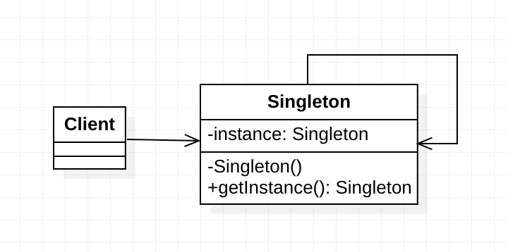
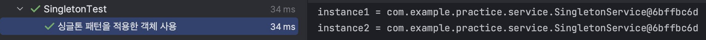
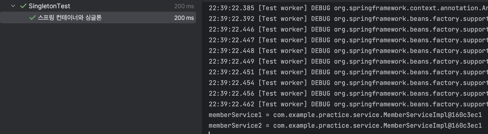

# 싱글톤 패턴 (Singleton Pattern)

## 개요

우리는 보통 `new` 명령어를 통해 인스턴스를 생성해서 사용한다. `new`를 통해 클래스를 10번 호출하면 10개의 인스턴스가 생기는 것이다.

그런데 클래스의 인스턴스가 단 하나만 필요한 경우가 있다. 시스템안에서 하나의 인스턴스만 생성되서 사용되야하는 클래스들인데
예를 들면 회사내의 공공재로 사용하는 프린터나 컴퓨터등이 그렇다. 우리가 원한다고 마음대로 `new`를 통해 생성할수도 없는 것들이다.

물론, 조심해서 `new`를 한 번만 사용해서 1개의 인스턴스만 사용하겠다고 할 수도 있지만, 이것은 결코 지정한 클래스가 '반드시' 1개 밖에 존재하지 않는 것을 '보증' 할 수 없다.  
이처럼 인스턴스가 한 개밖에 존재하지 않는 것을 보증하는 패턴을 `Singletone pattern` 이라 한다.


이를 통해 전역적으로 사용되는 자원에 대한 중복 생성을 방지하고, 객체 간의 정보 공유를 쉽게 구현할 수 있다.

### 다이어그램


- 싱글톤 클래스는 정적 메서드 getInstance를 선언한다. 
- 이 메서드는 자체 클래스의 같은 인스턴스를 반환합니다.
- 싱글톤의 생성자는 private으로 선언한다. 
- getInstance 메서드를 호출함으로써 싱글톤 객체를 가져오고, 이는 객체를 받아올 수있는 유일한 방법이다.
### 구현 코드
```java
public class Singleton {

    private static Singleton instance = null;
    
    private Singleton() {
    }

    public static Singleton getInstance() {
        if (instance == null) {
            instance = new Singleton();
        }
        return singleton;
    }
}
```

### 구현 방법

싱글톤 패턴을 구현하기 위해 다음과 같은 요소를 고려해야 한다.

1. `생성자를 비공개로 만들기`: 클래스의 생성자를 비공개로 만들어 외부에서 직접 객체를 생성하지 못하도록 한다.
2. `유일한 인스턴스 생성`: 클래스 내부에서 유일한 인스턴스를 생성하고 이를 저장한다.
3. `인스턴스 접근 방법 제공`: 외부에서 유일한 인스턴스에 접근할 수 있는 메서드를 제공한다.
4. `지연된 초기화를 구현`: 첫 번째 호출에서 새 객체를 만든 후 그 객체를 정적 필드에 저장한다. 이후 모든 후속 호출들에서 항상 해당 인스턴스를 반환해야 한다.
---
## Spring에서의 적용
### 예시 상황


스프링 환경에서 구현된 회원을 관리하는 서비스 다이어그램이다.

- 회원 서비스 역할은 MemberService 인터페이스와 MemberServiceImpl을 통해 구현된다.
- 회원 서비스는 Member(회원)를 MemberRepository를 이용해 저장하고 찾는 기능을 수행한다.
- 회원 저장소 역할은 MemberRepository 인터페이스와 MemoryMemberRepository를 통해 구현된다.
- MemoryMemberRepository는 HashMap을 이용해 메모리에 회원들을 저장한다.

### 문제점 (싱글톤 적용 전; BEFORE)
회원서비스를 사용하는 클라이언트가 여럿 존재한다고 가정할 때, 한 서비스 계층당 하나의 빈들만 주입해야한다고해도 매번 객체가 생성되서 사용되고 참조가 해제되어 GC에 수집어 정리가 되는 과정을 거쳐야 한다. 이는 몹시 비효율적이고 메모리낭비이다.

게다가 해당 빈들은 굳이 사용자마자 다른 인자값을 가지는 인스턴스가 될 일도 없다. 모두 동일한 빈 사용을위해 서비스 호출때마다 새로운 빈들이 생성, 삭제가 되어야 한다는 것이다.

### 문제점 확인코드

```java
public class SingletonTest {
    @Test
    @DisplayName("순수 DI 컨테이너")
    void pureContainer() {
        // given
        AppConfig appConfig = new AppConfig();

        // when
        MemberService memberService1 = appConfig.memberService();
        MemberService memberService2 = appConfig.memberService();

        // then
        assertThat(memberService1).isNotSameAs(memberService2);
    }
}
```

### 결과


조회한 빈의 참조 주소가 다른 것을 알 수있다. 즉 클라이언트가 매 서비스를 호출 할때마다 불필요하게 인스턴스가 생성된다는 의미다.
그렇기에 싱글톤 패턴을 사용해 객체를 재사용하는 식으로 메모리 낭비를 막아야 한다.

### 싱글톤 서비스
```java
public class SingletonService {
    private static SingletonService instance = null;

    private SingletonService() {
    }

    public static SingletonService getInstance() {
        if (instance == null) {
            instance = new SingletonService();
        }
        return instance;
    }
    
    public void logic() {
        System.out.println("called singleton");
    }
}
```
- 기본 생성자를 private으로 선언하여 외부에서 해당 서비스를 생성할 수 없도록 막았다.
- 최초 호출시 한번만 생성되고 이후에는 새로운 인스턴스를 생성할 수 없다.
- 해당 서비스가 필요하면 getInstance() 메서드를 통해 해당 서비스를 사용한다.

### 확인 코드
```java
    @Test
    @DisplayName("싱글톤 패턴을 적용한 객체 사용")
    void singletonService() {
        SingletonService instance1 = SingletonService.getInstance();
        SingletonService instance2 = SingletonService.getInstance();

        System.out.println("instance1 = " + instance1);
        System.out.println("instance2 = " + instance2);

        assertThat(instance1).isSameAs(instance2);
    }
```

### 결과

싱글톤 서비스를 이용하는 인스턴스의 참조가 일치하는 것을 알 수있다. 
이를 통해 서비스를 호출 할때마다 불필요하게 인스턴스가 생성되는 것을 막아 메모리 낭비를 막을 수 있다.

---

## 싱글톤 패턴의 장단점

#### 장점
- 메모리와 성능을 효율적으로 관리할 수 있다.
- 동일한 객체를 여러 번 생성하지 않으므로 자원 소모를 줄일 수 있다.
- 전역 상태나 자원에 대한 접근을 효율적으로 관리할 수 있다.
- 코드 중복을 방지하고 객체 간의 일관성을 유지할 수 있다.

#### 단점

- 싱글톤 패턴을 적용하기 위해 구현할 코드양이 많아지면서 비용이 늘어난다.
- 의존관계상 클라이언트가 구현체에 의존하면서 DIP를 위반하게 된다.
- DIP를 위반하면 자연스럽게 OCP를 위반할 가능성도 높아진다.
- 테스트가 어려워진다.
  ⇒ 인스턴스를 미리 다 받아서 설정이 끝난 상태이기에 유연한 테스트가 힘들다.

- 내부 속성을 변경하거나 초기화가 어렵다.
- private생성자로 자식 클래스를 만들기 어렵다.
- 유연성이 떨어진다.
- 안티패턴으로 불리기도 한다.


---
## 싱글톤 컨테이너
그러면 서비스를 개발 할때마다 싱글톤 패턴을 적용해서 구현해야할까?

스프링 컨테이너는 싱글톤패턴의 많은 단점들을 해결하면서 객체 인스턴스를 싱글톤으로 관리한다.

- 스프링 컨테이너는 싱글톤 패턴을 적용하지 않아도 싱글톤으로 객체들을 관리한다.
- 스프링 컨테이너는 싱글톤 컨테이너 역할을 한다. 이처럼 싱글톤 객체를 생성및 관리하는 기능을 싱글톤 레지스트리라 한다.
- 이렇게 스프링 컨테이너에서 싱글톤 컨테이너 역할을 해줌으로써 싱글톤 패턴의 단점을 없애고 객체의 단일성을 유지할 수 있다.

  ⇒ 그렇기에 각각의 빈들은 싱글톤 패턴 적용을 위한 코드를 작성할 필요가 없다.

  ⇒ 더하여 DIP, OCP, 테스트, private 생성자를 고민하지 않아도 된다.

### 스프링 컨테이너를 이용한 싱글톤 서비스
```java
@Test
@DisplayName("스프링 컨테이너와 싱글톤")
void springContainer() {
        ApplicationContext ac = new AnnotationConfigApplicationContext(AppConfig.class);
        MemberService memberService1 = ac.getBean("memberService", MemberService.class);
        MemberService memberService2 = ac.getBean("memberService", MemberService.class);

        //참조값 확인
        System.out.println("memberService1 = " + memberService1);
        System.out.println("memberService2 = " + memberService2);

        //memberService != memberService2
        assertThat(memberService1).isSameAs(memberService2);
        }
```

### 결과

빈으로 등록된 MemberService 인스턴스가 빈으로 등록되면 싱글톤으로 관리 되는 것을 확인 할 수 있다.
