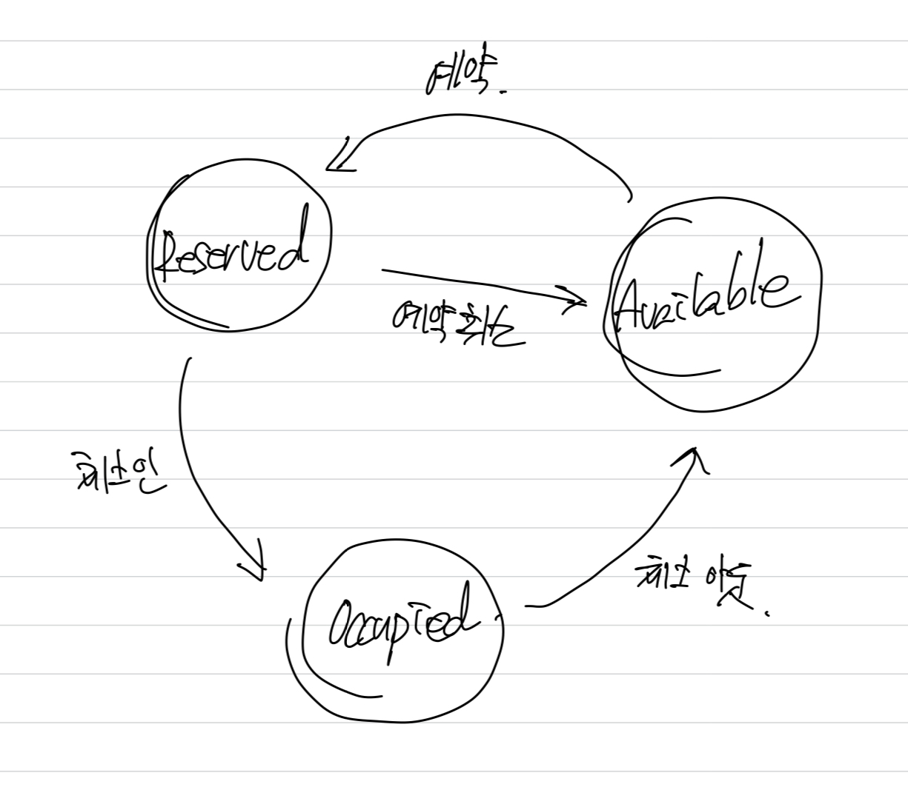
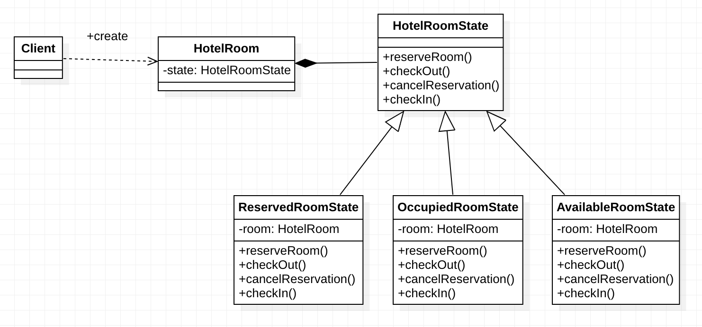
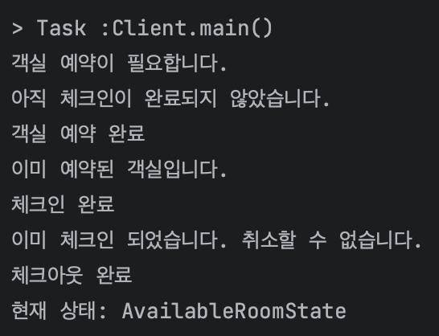

# 상태패턴(State Pattern)

## 개요

객체의 내부 상태에 따라 객체의 동작이 달라지는 패턴을 말한다.

상태 패턴으로 리팩터링하는 주된 목적은 상태 전이를 위한 조건 로직이 지나치게 복잡한 경우 이를 해소하기 위함이다. 

상태 전이 로직이란 객체의 상태와 이들 간의 전이 방법을 제어하는 것으로, 클래스 내부 여기저기에 흩어져 존재하는 경향이 있다. 
State 패턴을 구현한다는 것은 각 상태에 대응하는 별도의 클래스를 만들고 상태 전이 로직을 그 클래스들로 옮기는 작업을 뜻한다. 

이 때 원래의 호스트 객체를 [Design Patterns]에서는 컨텍스트context라 부르는데, 컨텍스트 객체는 상태와 관련된 기능을 스테이트 객체에 위임한다.
그리고 상태 전이는 컨텍스트 객체의 대리 객체를 한 스테이트 객체에서 다른 스테이트 객체로 바꾸는 일이 된다.

## 적용 상황


다음과 같은 서비스를 제공하는 호텔 시스템이 있다고 가정하자.
- 예약 : reserveRoom()
- 체크인 : checkIn()
- 체크아웃 : checkOut()
- 예약취소 : cancelReservation()

예약이 선행되어야하고 그다음 체크인, 체크아웃이 이루어져야한다고 하자. 이 순서가 지켜져야 상태의 전이가 일어 날 수 있고, 

예약 취소는 예약이 이루어진 상태에서만 가능하다고 하자.

### 레거시코드(Before)
```java
public enum HotelState {
    RESERVED, OCCUPIED, AVAILABLE
}

```

```java
/**
 * HotelSystem은 호텔 객실 상태를 관리하는 클래스입니다.
 * 이 클래스를 사용하여 객실 예약, 체크인, 체크아웃 및 예약 취소를 수행할 수 있습니다.
 */
public class HotelSystem {
    private HotelState hotelState;

    /**
     * HotelSystem의 생성자입니다. 기본 상태는 AVAILABLE로 설정됩니다.
     */
    public HotelSystem() {
        this.hotelState = HotelState.AVAILABLE;
    }

    /**
     * 객실을 예약하는 메서드입니다.
     * 현재 상태에 따라 예약이 가능하거나 불가능합니다.
     */
    public void reserveRoom() {
        if (this.hotelState == HotelState.AVAILABLE) {
            System.out.println("객실 예약 완료");
            this.hotelState = HotelState.RESERVED;
        } else if (this.hotelState == HotelState.RESERVED) {
            System.out.println("이미 예약된 객실입니다.");
        } else if (this.hotelState == HotelState.OCCUPIED) {
            System.out.println("이미 체크인 되었습니다.");
        } else {
            System.out.println("잘못된 예약 상태입니다.");
        }
    }

    /**
     * 객실에 체크인하는 메서드입니다.
     * 예약된 상태에서만 체크인이 가능합니다.
     */
    public void checkIn() {
        if (this.hotelState == HotelState.RESERVED) {
            System.out.println("체크인 완료");
            this.hotelState = HotelState.OCCUPIED;
        } else if (this.hotelState == HotelState.AVAILABLE) {
            System.out.println("객실 예약이 필요합니다.");
        } else if (this.hotelState == HotelState.OCCUPIED) {
            System.out.println("이미 체크인 되었습니다.");
        } else {
            System.out.println("잘못된 예약 상태입니다.");
        }
    }

    /**
     * 객실에서 체크아웃하는 메서드입니다.
     * 체크인된 상태에서만 체크아웃이 가능합니다.
     */
    public void checkOut() {
        if (this.hotelState == HotelState.OCCUPIED) {
            System.out.println("체크아웃 완료");
            this.hotelState = HotelState.AVAILABLE;
        } else if (this.hotelState == HotelState.AVAILABLE) {
            System.out.println("아직 체크인이 완료되지 않았습니다.");
        } else if (this.hotelState == HotelState.RESERVED) {
            System.out.println("아직 체크인이 완료되지 않았습니다.");
        } else {
            System.out.println("잘못된 예약 상태입니다.");
        }
    }

    /**
     * 객실 예약을 취소하는 메서드입니다.
     * 예약된 상태에서만 예약 취소가 가능합니다.
     */
    public void cancelReservation() {
        if (this.hotelState == HotelState.RESERVED) {
            System.out.println("객실 예약 취소");
            this.hotelState = HotelState.AVAILABLE;
        } else if (this.hotelState == HotelState.AVAILABLE) {
            System.out.println("예약된 객실이 없습니다.");
        } else if (this.hotelState == HotelState.OCCUPIED) {
            System.out.println("이미 체크인 되었습니다. 취소할 수 없습니다.");
        } else {
            System.out.println("잘못된 예약 상태입니다.");
        }
    }
}

```
이 레거시 코드는 다음과 같은 상황에 놓여있기 때문에 상태패턴을 적용하기 적절하다고 판단 할 수 있다.
- 객체의 행동(메서드)가 상태(state)에 따라 각기 다른 동작을 할때.
- 상태 및 전환에 걸쳐 대규모 조건 분기 코드와 중복 코드가 많을 경우
- 런타임단에서 객체의 상태를 유동적으로 변경해야 할때

이 레거시 코드에는 3가지 상태가 존재하고 상태에 따라 각기 다른 동작을 한다.


이제 이 코드에 상태패턴을 적용해보자.
### 상태패턴 다이어그램


- 먼저 Client에서 HotelRoom 객체를 통해서 이 호텔 시스템을 사용한다.

- HotelRoom 객체는 이 상태에 역할을 맡은 인터페이스를 필드로 갖고있다.

- 그리고 이 인터페이스를 구현한 각 구현체들이 존재한다.(ReservedRoomState, OccupiedRoomState, AvailableRoomState)
- 그래서 이 구현체들이 번갈아 끼워질 때마다 HotelRoom 객체의 상태가 변경되면서 행동도 변경될 수 있게 된다.

- 빌더 패턴은 이와같이 Client가 있고 Context(HotelRoom), State Interface(HotelRoomState), ConcreteState(구현체들)로 구성된 패턴이다.


## 구현 코드
```java
/**
 * HotelRoomState 인터페이스는 호텔 객실 상태를 관리하기 위한 메서드들을 정의합니다.
 * 구현 클래스는 이 인터페이스를 구현하여 객실의 상태 전이를 처리할 수 있습니다.
 */
public interface HotelRoomState {
    /**
     * 객실을 예약하는 메서드를 정의합니다.
     * 예약 과정에 따라 구현됩니다.
     */
    void reserveRoom();

    /**
     * 객실에 체크인하는 메서드를 정의합니다.
     * 체크인 과정에 따라 구현됩니다.
     */
    void checkIn();

    /**
     * 객실에서 체크아웃하는 메서드를 정의합니다.
     * 체크아웃 과정에 따라 구현됩니다.
     */
    void checkOut();

    /**
     * 객실 예약을 취소하는 메서드를 정의합니다.
     * 예약 취소 과정에 따라 구현됩니다.
     */
    void cancelReservation();
}

```
HotelRoomState: 각 상태별로 필요한 행동을 캡슐화한 인터페이스다.


```java

/**
 * ReservedRoomState 클래스는 호텔 객실의 예약된 상태를 나타냅니다.
 * 이 클래스는 HotelRoomState 인터페이스를 구현하여 객실의 상태 전이를 처리합니다.
 *
 * @see HotelRoomState
 */
public class ReservedRoomState implements HotelRoomState {
    private HotelRoom hotelRoom;

    /**
     * ReservedRoomState 클래스의 생성자입니다.
     *
     * @param hotelRoom 해당 객실을 나타내는 HotelRoom 객체입니다.
     */
    public ReservedRoomState(HotelRoom hotelRoom) {
        this.hotelRoom = hotelRoom;
    }

    /**
     * 객실을 예약하려고 할 때 호출되는 메서드입니다.
     * 이미 예약된 객실임을 알립니다.
     */
    @Override
    public void reserveRoom() {
        System.out.println("이미 예약된 객실입니다.");
    }

    /**
     * 예약된 객실에서 체크인할 때 호출되는 메서드입니다.
     * 체크인을 완료하고 객실 상태를 변경합니다.
     */
    @Override
    public void checkIn() {
        System.out.println("체크인 완료");
        hotelRoom.changeState(new OccupiedRoomState(hotelRoom));
    }

    /**
     * 예약된 객실에서 체크아웃하려고 할 때 호출되는 메서드입니다.
     * 아직 체크인이 완료되지 않았음을 알립니다.
     */
    @Override
    public void checkOut() {
        System.out.println("아직 체크인이 완료되지 않았습니다.");
    }

    /**
     * 예약된 객실의 예약을 취소하려고 할 때 호출되는 메서드입니다.
     * 객실 예약을 취소하고 객실 상태를 변경합니다.
     */
    @Override
    public void cancelReservation() {
        System.out.println("객실 예약 취소");
        hotelRoom.changeState(new AvailableRoomState(hotelRoom));
    }
}

```
```java
/**
 * OccupiedRoomState 클래스는 호텔 객실의 체크인된 상태를 나타냅니다.
 * 이 클래스는 HotelRoomState 인터페이스를 구현하여 객실의 상태 전이를 처리합니다.
 *
 * @see HotelRoomState
 */
public class OccupiedRoomState implements HotelRoomState {
    private HotelRoom hotelRoom;

    /**
     * OccupiedRoomState 클래스의 생성자입니다.
     *
     * @param hotelRoom 해당 객실을 나타내는 HotelRoom 객체입니다.
     */
    public OccupiedRoomState(HotelRoom hotelRoom) {
        this.hotelRoom = hotelRoom;
    }

    /**
     * 객실을 예약하려고 할 때 호출되는 메서드입니다.
     * 이미 체크인된 객실임을 알립니다.
     */
    @Override
    public void reserveRoom() {
        System.out.println("이미 체크인 되었습니다.");
    }

    /**
     * 이미 체크인된 객실에서 체크인을 시도할 때 호출되는 메서드입니다.
     * 이미 체크인된 객실임을 알립니다.
     */
    @Override
    public void checkIn() {
        System.out.println("이미 체크인 되었습니다.");
    }

    /**
     * 체크인된 객실에서 체크아웃할 때 호출되는 메서드입니다.
     * 체크아웃을 완료하고 객실 상태를 변경합니다.
     */
    @Override
    public void checkOut() {
        System.out.println("체크아웃 완료");
        hotelRoom.changeState(new AvailableRoomState(hotelRoom));
    }

    /**
     * 체크인된 객실의 예약을 취소하려고 할 때 호출되는 메서드입니다.
     * 이미 체크인된 객실이기 때문에 예약을 취소할 수 없음을 알립니다.
     */
    @Override
    public void cancelReservation() {
        System.out.println("이미 체크인 되었습니다. 취소할 수 없습니다.");
    }
}
```
```java
/**
 * AvailableRoomState 클래스는 호텔 객실의 사용 가능한 상태를 나타냅니다.
 * 이 클래스는 HotelRoomState 인터페이스를 구현하여 객실의 상태 전이를 처리합니다.
 *
 * @see HotelRoomState
 */
public class AvailableRoomState implements HotelRoomState {
    private final HotelRoom room;

    /**
     * AvailableRoomState 클래스의 생성자입니다.
     *
     * @param hotelRoom 해당 객실을 나타내는 HotelRoom 객체입니다.
     */
    public AvailableRoomState(HotelRoom hotelRoom) {
        this.room = hotelRoom;
    }

    /**
     * 객실을 예약하려고 할 때 호출되는 메서드입니다.
     * 객실을 예약하고 객실 상태를 변경합니다.
     */
    @Override
    public void reserveRoom() {
        System.out.println("객실 예약 완료");
        room.changeState(new ReservedRoomState(room));
    }

    /**
     * 사용 가능한 객실에서 체크인을 시도할 때 호출되는 메서드입니다.
     * 먼저 객실을 예약해야만 체크인이 가능함을 알립니다.
     */
    @Override
    public void checkIn() {
        System.out.println("객실 예약이 필요합니다.");
    }

    /**
     * 사용 가능한 객실에서 체크아웃하려고 할 때 호출되는 메서드입니다.
     * 아직 체크인이 완료되지 않았음을 알립니다.
     */
    @Override
    public void checkOut() {
        System.out.println("아직 체크인이 완료되지 않았습니다.");
    }

    /**
     * 예약된 객실을 취소하려고 할 때 호출되는 메서드입니다.
     * 예약된 객실이 없음을 알립니다.
     */
    @Override
    public void cancelReservation() {
        System.out.println("예약된 객실이 없습니다.");
    }
}
```
Context의 상태에 따른 실제 행동을 구현한 클래스들이다. (ReservedRoomState, OccupiedRoomState, AvailableRoomState)
```java
/**
 * HotelRoom 클래스는 호텔 객실의 상태를 관리하고 객실 상태 전이를 처리하는 클래스입니다.
 * 객실 상태는 HotelRoomState 객체를 통해 관리됩니다.
 */
public class HotelRoom {
    private HotelRoomState state;

    /**
     * HotelRoom의 상태를 변경하는 메서드입니다.
     *
     * @param state 새로운 객실 상태를 나타내는 HotelRoomState 객체입니다.
     */
    void changeState(HotelRoomState state) {
        this.state = state;
    }

    /**
     * 객실을 예약하는 메서드입니다.
     * 현재 상태에 따라 예약이 가능하거나 불가능합니다.
     */
    public void reserveRoom() {
        state.reserveRoom();
    }

    /**
     * 객실에 체크인하는 메서드입니다.
     * 현재 상태에 따라 체크인이 가능하거나 불가능합니다.
     */
    public void checkIn() {
        state.checkIn();
    }

    /**
     * 객실에서 체크아웃하는 메서드입니다.
     * 현재 상태에 따라 체크아웃이 가능하거나 불가능합니다.
     */
    public void checkOut() {
        state.checkOut();
    }

    /**
     * 객실 예약을 취소하는 메서드입니다.
     * 현재 상태에 따라 예약 취소가 가능하거나 불가능합니다.
     */
    public void cancelReservation() {
        state.cancelReservation();
    }

    /**
     * 현재 객실의 상태를 문자열 형태로 반환하는 메서드입니다.
     *
     * @return 현재 객실의 상태를 나타내는 문자열입니다.
     */
    public String getState() {
        return state.getClass().getSimpleName();
    }
}

```
HotelRoom : 상태를 가지고 있는 객체로써 상태에 따라 행동이 달라지는 클래스이다.
```java
/**
 * Client 클래스는 호텔 객실 예약 및 상태 전이를 테스트하는 예제 프로그램입니다.
 * 이 클래스를 실행하여 HotelRoom과 관련된 다양한 작업을 시뮬레이션할 수 있습니다.
 */
public class Client {
    /**
     * Client 클래스의 메인 메서드입니다.
     *
     * @param args 명령줄 인수 (사용되지 않음).
     */
    public static void main(String[] args) {
        // HotelRoom 객체 생성 및 초기 상태 설정
        HotelRoom room = new HotelRoom();
        room.changeState(new AvailableRoomState(room));

        // 객실 체크인 및 체크아웃 테스트
        room.checkIn(); // Available : 객실 예약이 필요합니다.
        room.checkOut(); // Available : 아직 체크인이 완료되지 않았습니다.

        // 객실 예약 테스트 (두 번 예약 시도)
        room.reserveRoom(); // Available -> Reserved: 객실 예약 완료
        room.reserveRoom(); // Reserved : 이미 예약된 객실입니다.

        // 객실 체크인 및 예약 취소 테스트
        room.checkIn(); // Reserved -> OccupiedRoomState : 체크인 완료
        room.cancelReservation(); // OccupiedRoomState : 이미 체크인 되었습니다. 취소할 수 없습니다.

        // 객실 체크아웃 및 현재 상태 출력
        room.checkOut(); // OccupiedRoomState  -> Available : 체크아웃 완료.
        System.out.println("현재 상태: " + room.getState()); // Available: 현재상태: AvailableRoomState
    }
}

```
호텔룸 객체를 사용해 시스템을 이용한다.
호텔룸의 초기상태를 Availabe 한 상태로 시작해 두었다.
### 결과


상태의 전이가 정상적으로 이루어지는 것을 볼 수있고, 상태에 따라 실행되는 행동이 달라지는 것을 볼 수 있다.
## 상태 패턴의 장단점
### 장점
- SRP(Single Responsibility Principle) : 단일 책임의 원칙을 지킨다.
  - 모든 클래스는 각각 하나의 책임만 가져야한다는 원칙이다.
  - 기존 레거시 코드는 하나의 코드가 모든 상태에 대한 책임을 갖고있다. 
  - 개선된 코드는 각 클래스는 하나의 상태만 관리하고 있다.
- OCP(Open-Closed Principle) : 개방 폐쇄의 원칙을 지킨다.
  - 확장에는 열려있고 수정에는 닫혀있어야 한다는 원칙이다.
  - 기존 State 클래스나 컨텍스트를 변경하지 않고 새 State를 도입할 수 있다
- 상태의 전이를 더욱 명확히한다.
- 상태와 관련된 모든 동작을 각각의 클래스에 분산시킴으로써 코드 복잡도를 줄일 수 있다.

### 단점
- 상태 별로 클래스를 생성하므로, 관리해야할 클래스 수 증가한다.
- 상태 클래스 갯수가 많고 상태 규칙이 자주 변경된다면, Context의 상태 변경 코드가 복잡해지게 될 수 있다.
- 객체에 적용할 상태가 몇가지 밖에 없거나 거의 상태 변경이 이루어지지 않는 경우 패턴을 적용하는 것이 과도할 수 있다.

### 전략 패턴과의 차이점
상태패턴은 전략 패턴과 비슷해 보이지만 한 가지 중요한 차이점이 있다. 
상태 패턴에서의 특정 상태들은 서로를 인식하고 한 상태에서 다른 상태로 상태이동을 시작할 수 있지만 
전략패턴에서 전략들은 거의 대부분 서로에 대해 알지 못한다는 것에 있어서 차이가 존재한다.
