# 🎨 Design Pattern
Pro Digital Academy Design Pattern 설계 과제 <br><br>

## 📃 Contents
### [0. Design Pattern이란?](#0-design-pattern)
### [1. Bridge Pattern](#1-bridge-pattern)
### [2. Adapter Pattern](#2-adapter-pattern)
### [3. Strategy Pattern](#3-strategy-pattern)

<br><br>

## 0. Design Pattern

> 소프트웨어 디자인에서 자주 발생하는 문제를 해결하기 위한 공통된 설계 방법입니다.
디자인 패턴은 코드를 더 구조화하고 재사용 가능하며, 다른 개발자와 협업하기 쉽도록 도와줍니다.
>

### 주요 유형

- **생성(Creational) 패턴**
    - 객체를 생성해 사용하는 패턴이며, 대표 패턴으로 Singleton, Abstract Factory, Builder가 있다.
- **구조(Structural) 패턴**
    - 클래스와 객체를 조합해 사용하는 패턴이며, 대표 패턴으로 Adapter, Bridge, Decorator가 있다.
- **행동(Behavioral) 패턴**
    - 상호 작용을 하는 패턴이며, 대표 패턴으로 Command, Iterator, Observer가 있다.

<br>

💡 &nbsp; Design Pattern은 공통된 문제를 해결하기 위한 가이드라인을 제공하지만, 모든 상황에 항상 적용해야 하는 것은 아니기 때문에, 상황과 요구 사항에 따라 적절한 패턴을 선택하고 적용해야합니다! 
<br><br><br>

## 1. Bridge Pattern

### Bridge Pattern이란?
> 추상화와 구현을 분리하여 각각을 독립적으로 확장할 수 있게하는 구조적 디자인 패턴입니다. 분리된 두 계층을 연결하는 다리(Bridge)를 통해 연결됩니다.
> 

<br>
💡 &nbsp; Bridge Pattern은 기능 클래스 계층과 구현 클래스 계층을 분리하는 패턴입니다!
<br><br>

### 예시 Bridge Pattern 다이어그램
다이어그램에서는 기능과 구현의 두 개의 계층으로 분리되고, Display 클래스와 DisplayImpl 클래스가 집약관계로 연결되어 있는 것을 확인할 수 있습니다.

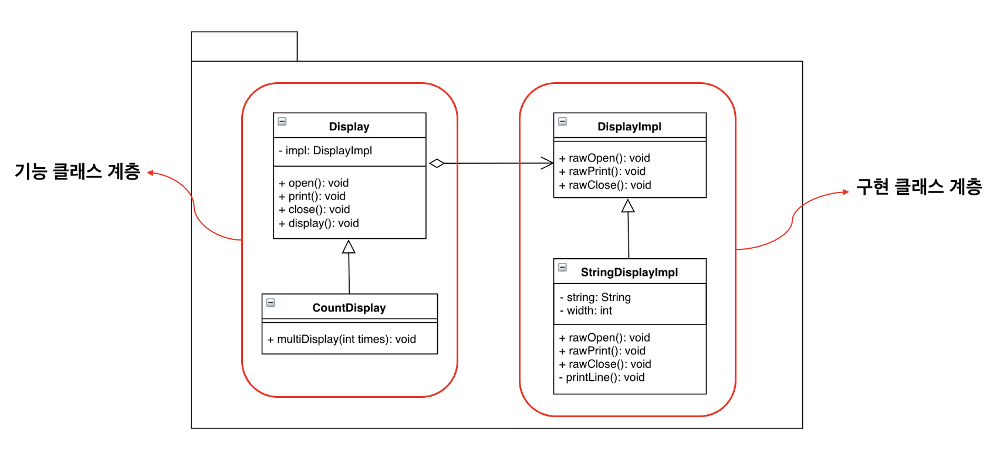

<br>

### ❓ 왜 Bridge Pattern을 사용할까
Bridge Pattern의 특징은 ‘기능의 클래스 계층’과 ‘구현의 클래스 계층’을 분리하는 것입니다. 이 두 개의 클래스 계층을 분리해 두면 각각의 클래스 계층을 독립적으로 확장할 수 있습니다. 즉, 새로운 기능을 추가하거나 새로운 구현을 도입할 때 다른 부분에 영향을 주지 않고 변경할 수 있기 때문에, 시스템이 더 유연해지고 확장성이 향상될 수 있습니다.

<br>

### ❓ 어떤 상황일 때 Bridge Pattern을 사용하면 좋을까
출판사에서 소설, 잡지, 문제집 등 다양한 서적을 출판하는 시나리오를 생각해 봅시다. 어떤 서적은 컬러로 어떤 서적은 흑백으로도 인쇄를 합니다. 소설은 흑백 프린터, 잡지는 컬러 프린터처럼 인쇄 타입을 지정 해서도 사용할 수 있지만, 만약 프린터 기기가 문제가 생겼을 경우 인쇄를 못하는 상황이 생길 수 있습니다. 이러한 상황에서 서적타입(기능)과 프린터타입(구현)이 분리되어 있다면, 프린터에 문제가 생겼을 때나 프린터를 업그레이드할 때 서적에는 아무런 영향을 주지 않습니다. 이처럼 Bridge Pattern을 사용하여 구조화시킨 ‘출판사 인쇄 시스템’을 살펴보겠습니다.

<br>

### 📚 출판사 인쇄 시스템
### 클래스 목록

| 클래스 계층 | 이름 | 설명 |
| :--- | :--- | :--- |
| 기능의 클래스 계층 | Publication | ‘출판물’을 나타내는 추상 클래스 |
|  | Book | ‘책 출판’을 나타내는 클래스 |
|  | Magazine | ‘잡지 출판’을 나타내는 클래스 |
| 구현의 클래스 계층 | Printer | ‘출판물을 인쇄하는 프린터’를 나타내는 인터페이스 |
|  | ColorPrinter | ‘컬러 프린터’를 나타내는 클래스 |
|  | BlackWhitePrinter | ‘흑백 프린터’를 나타내는 클래스 |
|  | Main | 동작 테스트용 클래스  |

<br>

### UML
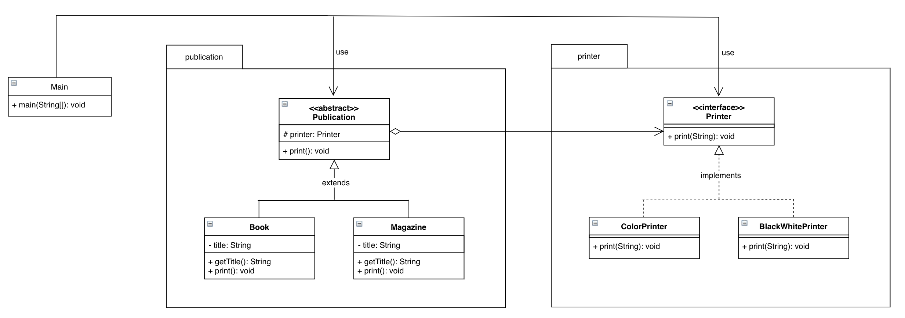

#### [기능 클래스 계층]
publication 패키지 안에 Publication, Book, Magazine 총 3개의 클래스가 있으며, Book과 Magazine 클래스는 추상 클래스로 선언된 Publication을 상속 받습니다. 상속받은 추상 메소드 print()은 각 클래스의 서적 타입에 맞춰서 Override됩니다.
여기서 주목하셔야하는 점은 상속 관계에 있는 하위 클래스의 객체들만 접근 가능하도록 protected로 선언된 Printer 객체입니다. Publication에서 선언된 Printer 객체는 하위클래스에서 구현클래스의 print(String)을 호출하는 데 사용됩니다.

<br>

#### [구현 클래스 계층]
printer 패키지 안에 Printer, ColorPrinter, BlackWhitePrinter 총 3개의 클래스가 있으며, ColorPrinter와 BlackWhitePrinter는 인터페이스로 선언된 Printer를 상속 받습니다. 상속받은 print(String) 메소드를 각 클래스의 인쇄타입에 맞춰  Override됩니다.
printer 패키지 안에 있는 클래스들은 모두 ‘구현 클래스’이기때문에 메소드에 대한 구현만 되어 있으며, 기능 클래스와 메인 클래스에서 실행됩니다.

<br><br>

### 동작 테스트 코드

```java
public class Main {
	public static void main(String[] args) {
		Printer color = new ColorPrinter();
        Printer blackWhite = new BlackWhitePrinter();

        Publication book1 = new Book("디자인 패턴", color);
        Publication book2 = new Book("도커&쿠버네티스", blackWhite);
        Publication magazine = new Magazine("그것이 알고싶다", blackWhite);

        System.out.println("=============== 책 출판 ===============");
        book1.print();
        System.out.println();
        book2.print();
        
        System.out.println("\n=============== 잡지 출판 ==============");
        magazine.print();
	}
}
```

<br>

### 실행 결과
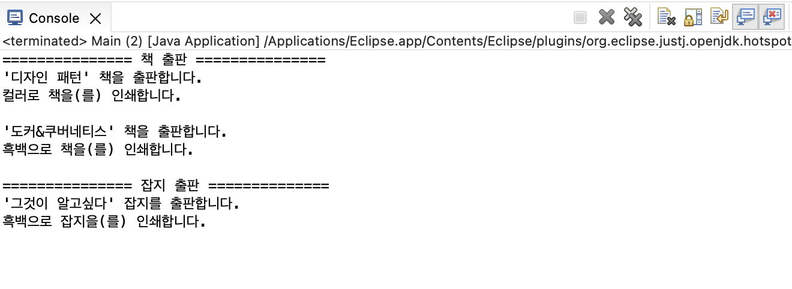

<br>

## 2. Adapter Pattern

### Adapter Pattern이란?
> 호환성이 없는 인터페이스 때문에 함께 동작할 수 없는 클래스들을 함께 작동해주도록 변환 역할을 해주는 구조적 디자인 패턴입니다.
> 

<br>
💡 &nbsp; Adapter Pattern은 이미 구축되어 있는 것을 새로운 어떤 것에 사용할 때 양 쪽 간의 호환성을 유지해 주기 위해 사용합니다! 
<br>

### Adapter Pattern 종류
- 클래스의 의한 Adapter Pattern(상속을 사용한 패턴)
- 인스턴스에 의한 Adapter Pattern(위임을 사용한 패턴)
<br>

❓ &nbsp; **실무에는 상속과 위임 중 어떤 것을 사용하나요?** <br>
✔️ &nbsp; 일반적으로 상속을 사용하는 것보다 위임을 사용하는 편이 문제가 적다. 그 이유는 상위 클래스의 내부동작을 자세히 모르면, 상속을 효과적으로 사용하기 어려운 경우가 많기 때문입니다. 
 
 <br>

### 예시 Adapter Pattern 다이어그램
다이어그램에서는 Target과 Adaptee(적응대상자)를 이어주는 Adapter가 있습니다. Adaptee는 이미 준비된 메소드를 가지고 있으며, Adapter는 Adaptee의 메소드를 사용해서 Target이 원하는 결과를 전달합니다.

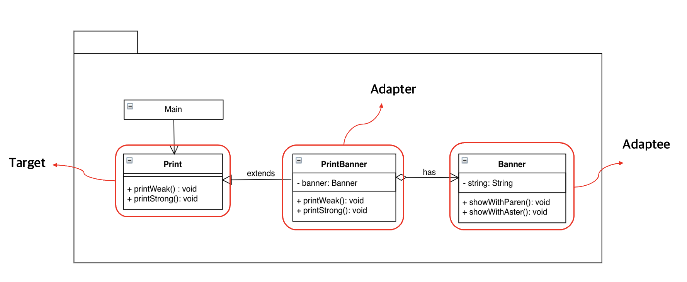

### ❓ 왜 Adapter Pattern을 사용할까
이미 존재하는 클래스나 라이브러리를 사용할 때, 해당 클래스나 라이브러리의 인터페이스가 현재 시스템과 호환되지 않는 경우에 Adapter Pattern을 사용합니다. 서로 간의 인터페이스를 Adapter로 일치시켜줌으로써 호환성을 유지하고 코드 재사용 할 수 있습니다.

<br>

### ❓ 어떤 상황일 때 Adapter Pattern을 사용하면 좋을까
기존에  alpha 라이브러리를 사용 중이었는데, 새롭게 구축하는 beta 라이브러리에서 alpha 라이브러리를 이용하는 시나리오를 생각해봅시다. 단순하게 alpha 라이브러리를 beta 라이브러리로 대체하게 되면, alpha 코드를 전반적으로 수정을 해야합니다. 그러나 alpha 코드와 beta 코드 사이의 중재자 역할을 하는 새로운 코드를 추가하면, 코드의 변경없이 기존의 코드를 재사용할 수 있습니다. 이처럼 Adapter를 사용하여 구조화시킨 ‘메시지 전달 시스템’을 살펴보겠습니다. 

<br>

### ✉️ Before: 메시지 전달 시스템
### 클래스 목록

|  | 이름 | 설명 |
| :--- | :--- | :--- |
| Target | MessageService | ‘필요한 메소드를 정의’하는 인터페이스 |
| Adapter | SMSServiceAdapter | ‘MessageService와 SMSService 클래스를 연결’하는 클래스 |
|  | EmailServiceAdapter | ‘MessageService와 EmailService 클래스를 연결’하는 클래스 |
| Adaptee | SMSService | ‘SMS 서비스’를 제공하는 클래스 |
|  | EmailService | ‘Email 서비스’를 제공하는 클래스 |
|  | Main | 동작 테스트용 클래스  |

<br>

### UML 
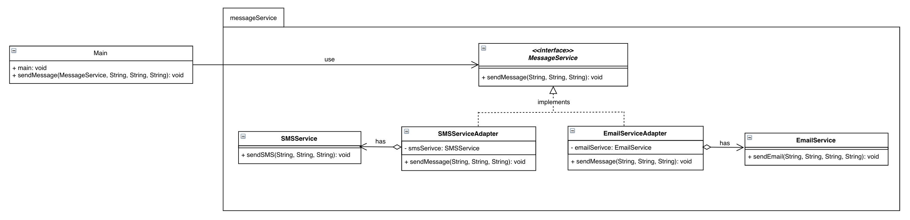

#### [Target]
MessageService 인터페이스는 메시지를 수신인에게 전달하는 함수를 가지고 있습니다.

<br>

#### [Adaptee]
해당 다이어그램에서의 Adaptee(적응 대상자)로 SMSService 클래스와 EmailService 클래스가 있습니다. Adaptee는 전달받은 메시지를 각 클래스에 따라 SMS, Email 타입으로 수신인에게 전달하는 함수를 가지고 있습니다.

<br>

#### [Adapter]
해당 다이어그램에서의 Adapter(적응자)로 SMSServiceAdapter 클래스와 EmailServiceAdapter 클래스가 있습니다. 각각의 클래스는 인터페이스로 선언된 MessageService를 상속 받습니다. 상속받은 sendMessage() 메소드를 각 클래스의 메시지 전송 타입에 맞춰 Override 됩니다. 또한 Adapter는 Adaptee의 메소드와 Target의 메소드가 서로 호환 가능하도록 합니다.

<br>

### 기능 추가
메시지에 담을 내용(content), 발신자(sender), 수신자(recipient)가 다수의 클래스 메소드에서 인자로 사용되는 것을 발견했습니다. <br>
반복되는 내용을 하나의 클래스로 만들어서 관리할 수 있도록 수정했습니다. 만약 인자의 수정 작업이 있을 때, 인자를 사용하는 메소드들을 모두 수정하는 것이 아니라 하나의 클래스만 수정할 수 있도록하여 코드 관리 효율성을 높였습니다.

<br>

#### 반복되는 인자들
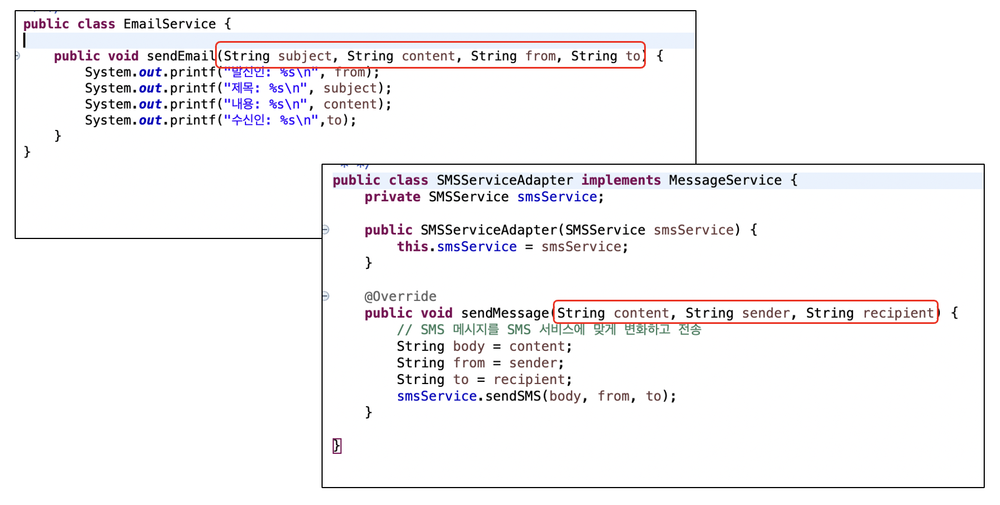

<br>

#### 공통적으로 사용되는 인자들을 Message 클래스로 관리
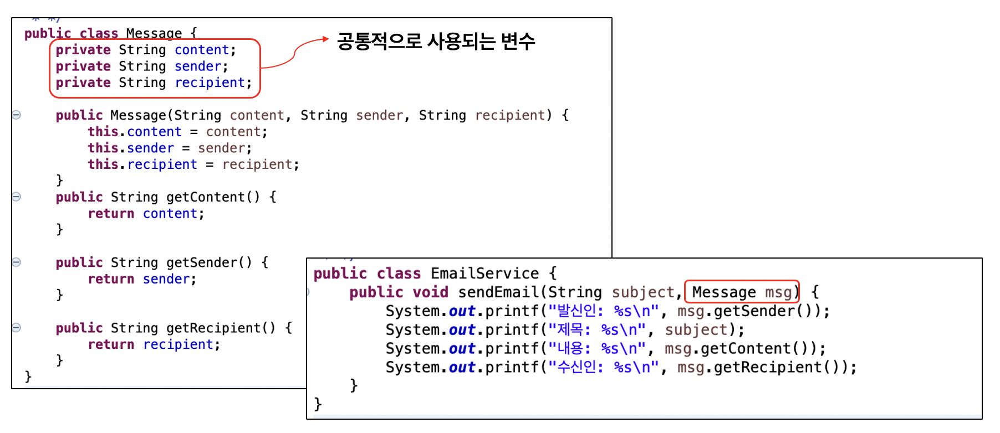

<br>

### ✉️ After: 메시지 전달 시스템
### 클래스 목록

|  | 이름 | 설명 |
| :--- | :--- | :--- |
| Target | MessageService | ‘필요한 메소드를 정의’하는 인터페이스 |
| Adapter | SMSServiceAdapter | ‘MessageService와 SMSService 클래스를 연결’하는 클래스 |
|  | EmailServiceAdapter | ‘MessageService와 EmailService 클래스를 연결’하는 클래스 |
| Adaptee | SMSService | ‘SMS 서비스’를 제공하는 클래스 |
|  | EmailService | ‘Email 서비스’를 제공하는 클래스 |
|  | Message | ‘메시지 정보’를 나타내는 클래스 |
|  | Main | 동작 테스트용 클래스  |

<br>

### UML 
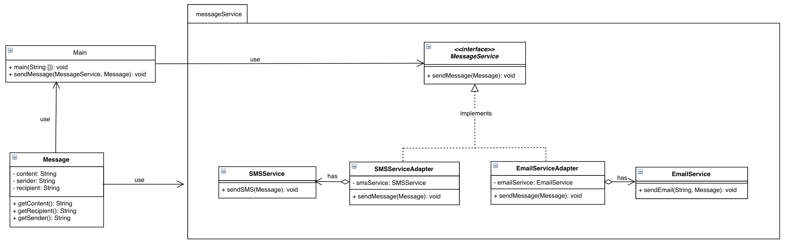

<br>

#### [Message]
메시지, 발신인, 수신인을 정보를 반환하는 클래스입니다. 세 개의 인자의 정보를 하나의 클래스에서 관리하여 유지보수성이 좋도록 했습니다.

<br>

#### 추가한 Message 코드 

```java
public class Message {
	// 메시지 내용 
	private String content;
	// 발신인 
	private String sender;
	// 수신인
	private String recipient;

	public Message(String content, String sender, String recipient) {
		this.content = content;
		this.sender = sender;
		this.recipient = recipient;
	}

	public String getContent() {
		return content;
	}

	public String getSender() {
		return sender;
	}

	public String getRecipient() {
		return recipient;
	}
}
```

<br>

#### Message 클래스를 사용 후 코드 변화
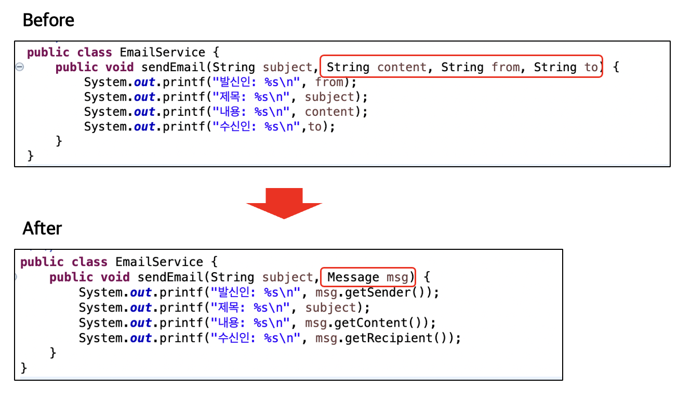

<br>

#### 동작 테스트 코드

```java
public class Main {
	// 주어진 MessageService를 사용하여 메시지를 전달하는 함수 
	public static void sendMessage(MessageService service, Message msg) {
		service.sendMessage(msg);
	}

	public static void main(String[] args) {
		MessageService emailAdapter = new EmailServiceAdapter(new EmailService());
		MessageService smsAdapter = new SMSServiceAdapter(new SMSService());
		
		// MessageService 인터페이스를 사용하여 메시지를 전송, 이메일 
		System.out.println("============= 이메일 전송 =============");
		Message emailMsg = new Message("이메일 전달드립니다!", "send@gmail.com", "recipient@gmail.com");
		sendMessage(emailAdapter, emailMsg);

		// MessageService 인터페이스를 사용하여 메시지를 전송, SMS  
		System.out.println("============== SMS 전송 ==============");
		Message smsMsg = new Message("메시지 전달드립니다!", "010-1111-2222", "010-1234-5678");
		sendMessage(smsAdapter, smsMsg);
	}
}
```

<br>

### 실행 결과
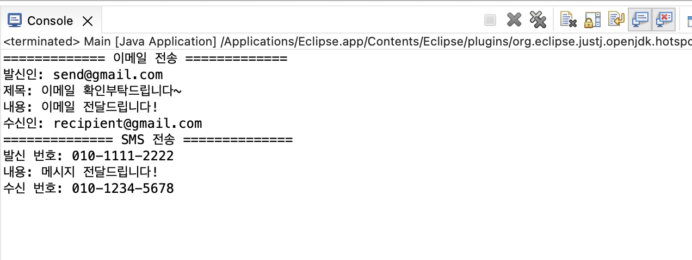

<br><br>

## 3. Strategy Pattern

### Strategy Pattern이란?
> 실행(런타임) 중에 알고리즘 전략을 선택하여 객체 동작을 실시간으로 바뀌도록 할 수 있게하는 디자인 패턴입니다.
> 

<br>
💡 &nbsp; Strategy Pattern은 어떤 일을 수행하는 알고리즘이 여러가지 일때, 동작들을 미리 전략으로 정의함으로써 손쉽게 전략을 교체할 수 있습니다! 

<br>

### 예시 Strategy Pattern 다이어그램
컨텍스트에서 작업을 자체적으로 실행하는 대신 전략 객체를 등록하고 실행합니다. 컨텍스트가 전략들에 의존하지 않게 되기때문에, 컨텍스트나 다른 전략의 코드를 변경하지 않고도 알고리즘 추가하고 수정할 수 있습니다.  <br>

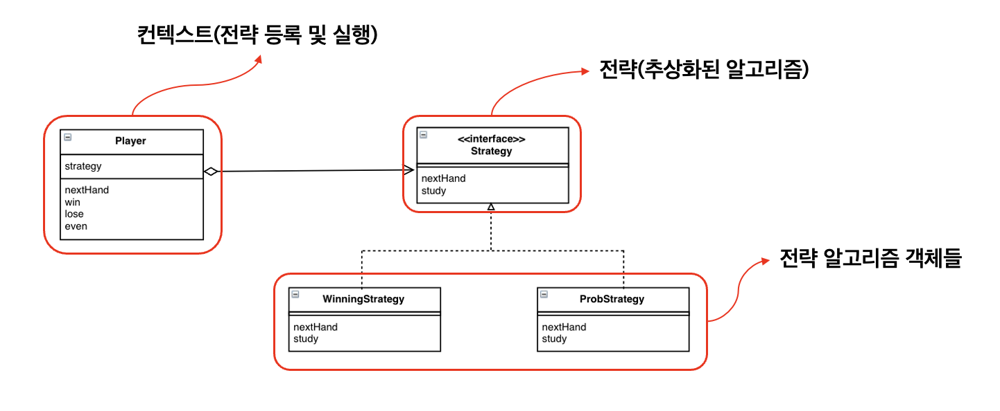

<br>

### ❓ 왜 Strategy Pattern을 사용할까
Strategy Pattern은 특정 컨텍스트에서 다양한 알고리즘이 적용될 수 있는 경우, 알고리즘을 별도로 분리하는 패턴입니다. 또한 OCP(Open Closed Principle)에 따라 컨텍스트를 변경하지 않고도 새로운 전략을 추가할 수 있습니다. <br>
즉 요구사항이 변경되었을 때 기존의 코드를 변경하지 않아도 된다는 것이 전략패턴의 장점이라 할 수 있습니다. 새로운 전략에 대해서는 새로운 클래스를 통해 관리하기 때문에 OCP의 원칙을 준수할 수 있는 패턴입니다.

<br>

### ❓어떤 상황일 때 Strategy Pattern을 사용하면 좋을까
서로 다른 알고리즘을 사용하여 유사한 작업을 수행해야 할 때, Strategy Pattern을 사용하면 중복 코드를 줄여주고, 유지보수성을 높여줍니다. 온라인 쇼핑몰에서 주문을 처리하는 시나리오를 생각해봅시다. 고객은 선택한 상품을 결제할 때 결제 방법을 선택해야 합니다. 결제방법은 카드 결제, 페이 결제 등 여러 지불 방법 중 하나를 선택해 결제를 진행한다고할 때, 전략패턴을 적용할 수 있습니다. 이처럼 Strategy Pattern을 사용하여 구조화시킨 ‘서적 주문∙결제 시스템’을 살펴보겠습니다.

<br>

### 💳 서적 주문∙결제 시스템
### 클래스 목록

| 이름 | 설명 |
| :--- | :--- |
| Order | ‘주문 정보’를 관리하는 클래스 |
| Payment | ‘결제 처리’를 위한 메서드를 정의하는 결제 인터페이스 |
| CheckCard | ‘체크 카드 결제’를 처리하는 클래스 |
| CreditCard | ‘신용 카드 결제’를 처리하는 클래스 |
| HeePay | ‘Hee Pay 결제’를 처리하는 클래스 |
| Card | ‘카드의 정보’를 나타내는 클래스 |
| Main | 동작 테스트용 클래스  |

<br>

### UML
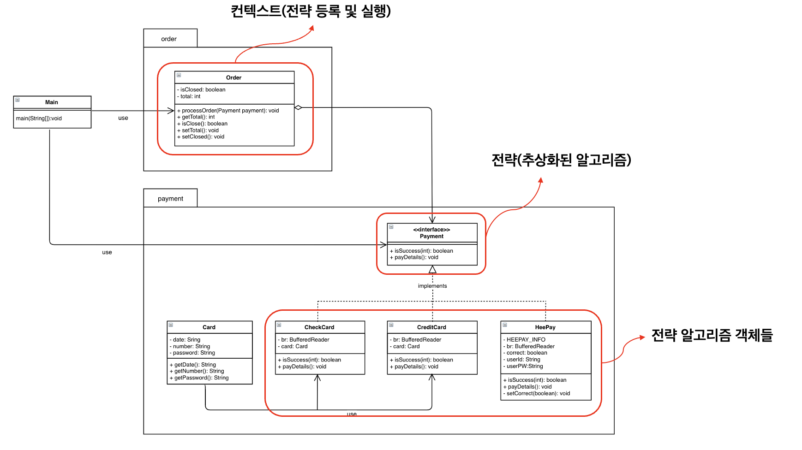

<br>

결제를 담당하는 전략과 주문을 담당하는 컨텍스트의 패키지를 분리해서 작성했습니다. 

#### [컨텍스트]
컨텍스트에서는 구상 전략 중 하나에 대한 참조를 유지하고 전략 인터페이스를 통해서만 이 객체와 통신합니다. Order 클래스에서는 결제에 대한 알고리즘을 실행해야 할 때마다 해당 알고리즘과 연결된 전략 객체의 메소드인 호출합니다. 여기서는 processOrder() 메소드에서 전략 객체의 메소드 payDetails()를 호출합니다. <br>
해당 예제는 고객이 결제하기 전까지 장바구니에 서적을 누적해서 담을 수 있기 때문에, Order 클래스의 isClosed를 통해 고객이 주문을 종료했는 지 여부를 체크하는 boolean형 변수를 가지고 있습니다. 또한 누적된 금액을 계산하기 위해 전역변수로 선언된 total 를 사용하여 누적 금액을 계산합니다. 

<br>

#### [전략]
전략 인터페이스는 모든 구상 전략에 공통으로 사용되는 인터페이스이며, 컨텍스트가 전략을 실행하는 데 사용하는 메서드를 선언합니다. Payment 인터페이스에는 결제의 성공 유무를 확인하는 메소드와 결제에 필요한 카드 또는 Pay 정보를 입력받는 메소드가 있습니다.

<br>

#### [전략 알고리즘 객체] 
모든 전략 알고리즘 객체는 컨텍스트가 사용하는 알고리즘의 다양한 변형들을 구현합니다. CheckCard와 CreditCard 클래스는 카드의 정보(카드번호, 만료일자, 비밀번호)를 나타내는 Card 클래스 객체를 통해 카드 결제를 시도합니다. HeePay에서는 초기화된 static 블록에 저장된 값과 입력받은 아이디와 비밀번호를 비교하여 결제를 시도합니다.

<br>

#### [클라이언트]
해당 다이어그램에서는 Main 클래스가 클라이언트 역할을 수행합니다. 특정 전략 객체를 만들어서 컨텍스트에 전달 함으로써, 전략을 등록하거나 변경하여 전략 알고리즘을 실행한 결과를 반환합니다.

<br><br>

### 동작 테스트 코드

```java
public class Main {
	private static final Map<Integer, Integer> BOOK_LIST = new HashMap<>(); 
	private static BufferedReader br = new BufferedReader(new InputStreamReader(System.in));
	private static Order order = new Order();
	private static Payment payment;

	// 목록 및 가격 설정을 위한 초기화 블록
	static {
		BOOK_LIST.put(1, 20000);
		BOOK_LIST.put(2, 23000);
		BOOK_LIST.put(3, 22000);
	}

	public static void main(String[] args) throws IOException {
		
		//주문이 끝날때까지 반복 
		while (!order.isClosed()) {
			int cost; // 구매할 책의 누적 금액
			String continueChoice; // 계속 구매할 지 여부를 체크

			do {
				System.out.print("[ 구매 가능한 책 리스트 ]\n" + 
						"1. 모던 웹 애플리케이션\n" + 
						"2. 마이크로서비스 도입 이렇게 한다 \n" +
						"3. python을 이용한 개인화 추천 시스템\n");

				System.out.print("구매할 책 번호를 입력해주세요 >> ");
				int choice = Integer.parseInt(br.readLine()); // 구매할 책 번호
				cost = BOOK_LIST.get(choice); // 선택한 책 가격

				System.out.print("구매할 권수를 입력해주세요 >> ");
				int cnt = Integer.parseInt(br.readLine()); // 구매할 책 수량
				order.setTotal(cost * cnt); // 구매할 책의 누적 금액 

				System.out.print("다른 상품도 구매하시겠습니까?(Y/N) ");
				continueChoice = br.readLine(); // Y 또는 N 여부로 체크
				System.out.println(); // 간격 조정

			} while (continueChoice.equalsIgnoreCase("Y"));

			// 결제 수단이 등록되어 있지 않을 때 
			if (payment == null) { 
				System.out.println("[ 결제 방법 리스트 ]\n" + 
						"1. 체크카드\n" +
						"2. 신용카드\n" +
						"3. 희 Pay");

				System.out.print("결제 방법을 입력해주세요 >> ");
				String paymentMethod = br.readLine(); // 결제 방법
				System.out.println(); // 간격 조정

				if (paymentMethod.equals("1")) { //체크카드 결제 
					payment = new CheckCard();
				} else if(paymentMethod.equals("2")) { //신용카드 결제
					payment = new CreditCard();
				} else { //페이 결제 
					payment = new HeePay();
				} 
			} //if end 

			// 주문 처리 
			order.processOrder(payment); 

			// 결제 여부
			System.out.print("결제금액은 " + order.getTotal() + "원 입니다. 결제 하시겠습니까?(Y/N) ");
			String proceed = br.readLine();
			
			if (proceed.equalsIgnoreCase("Y")) {
				if (payment.isSuccess(order.getTotal())) {
					System.out.println("결제에 성공했습니다!");
				} else {
					System.out.println("결제에 실패했습니다. 등록 정보를 다시 확인해주세요.");
				}
			} else {
				System.out.println("결제를 취소하셨습니다.");
			} //if end 
			
			order.setClosed(); //주문 종료
		} //while end 
	}
}
```

<br>

### 실행 결과 1
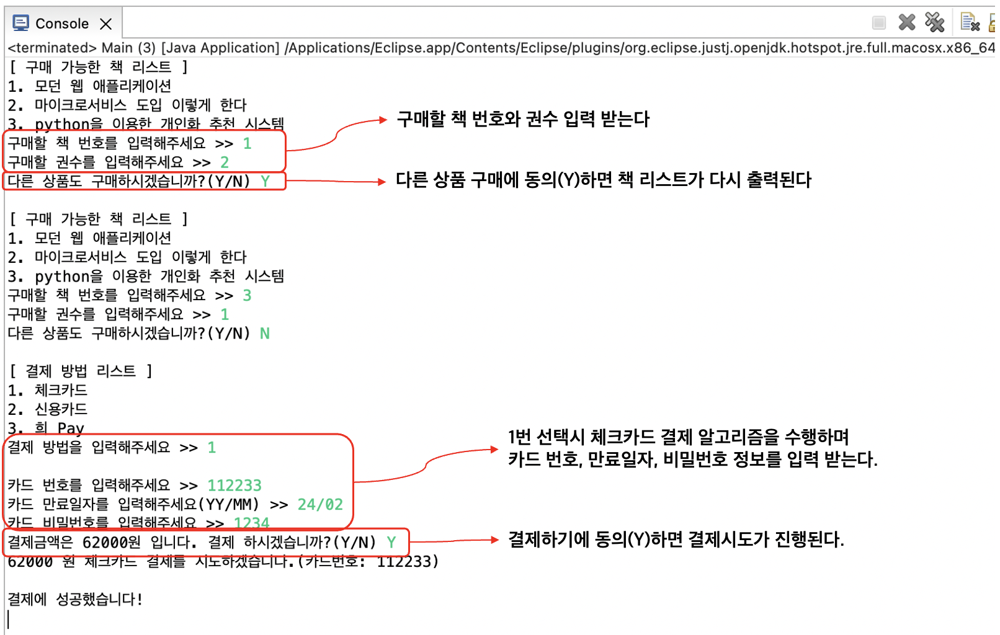

<br>

### 실행결과2
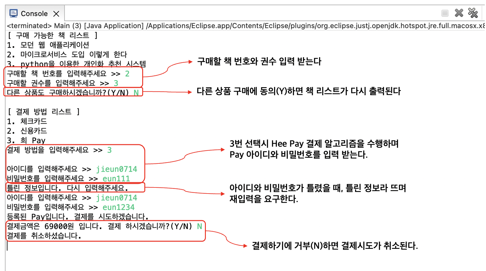

<br>

