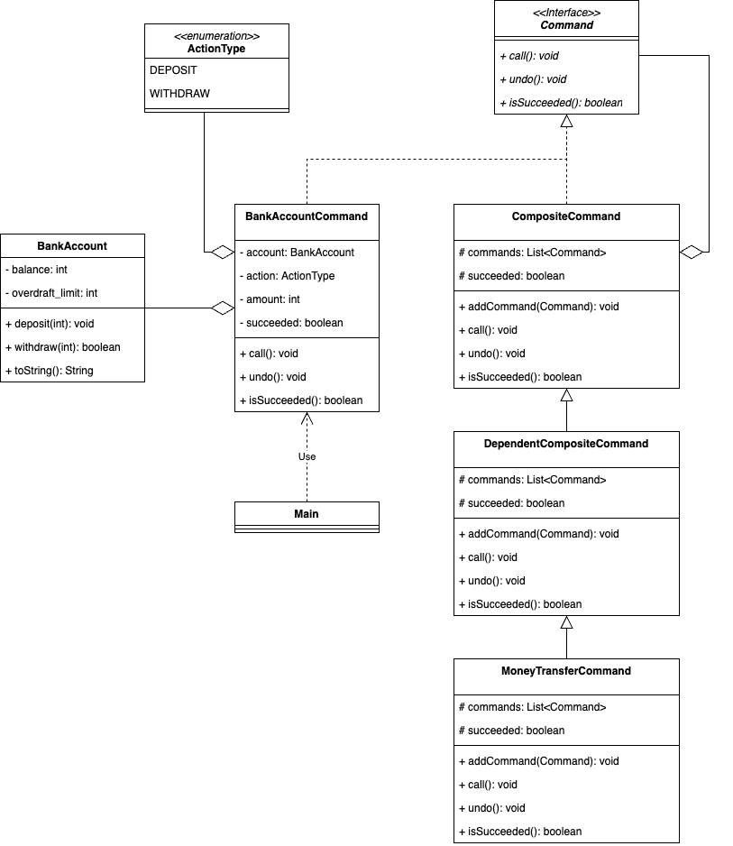

### Command 패턴 + Composite 패턴을 사용하여 간단한 은행 계좌 시스템 구현

> Command 패턴은 명령을 객체로 캡슐화하고, 명령을 수신하는 객체에서 명령을 처리할 메서드를 동적으로 결정한다.

> Composite 패턴은 복수와 단수를 동일시하여 재귀적인 구조를 만든다. 여러 개를 모아서 마치 하나의 것처럼 취급한다.

명령을 클래스의 멤버 함수로 표현하면 이력은 남지 않기 때문에
명령을 순서대로 기억을 해야 하거나 이력을 관리하고 싶을 때는 명령을 클래스로 표현하는 Command 패턴을 사용할 수 있다.

1. 은행 계좌의 입금 및 출금 작업을 처리하기 위해 Command 패턴을 사용하고,
2. 명령들을 조합하기 위해 Composite 패턴을 사용했다.

```markdown
📦 [package commandPattern1]
   │
   ├── account
   │   ├── ActionType.java : 명령의 종류 (입금 또는 출금)를 나타내는 Enum 타입
   │   ├── BankAccount.java : 은행 계좌의 잔액을 관리하고 입금 및 출금 명령을 처리하는 은행 계좌 클래스
   │   ├── BankAccountCommand.java : 은행 계좌에 대한 명령을 표현하는 클래스
   │   └── MoneyTransferCommand.java : 두 은행 계좌 간에 돈을 이체하는 명령 클래스
   ├── command
   │    ├── Command.java : 명령을 나타내는 인터페이스
   │    ├── CompositeCommand.java : 복수의 명령을 모은 명령을 표현하는 클래스
   │    └── DependentCompositeCommand.java : CompositeCommand 클래스에 기능을 추가한 클래스
   └── Main

```


- Command 인터페이스에 있는 메소드를 호출했을 때 구체적으로 무슨 일이 일어날지는 Command 인터페이스를 구현한 클래스가 결정한다.
- DependentCompositeCommand 클래스: CompositeCommand 클래스에 성공 여부에 따라 의존적으로 여러 명령을 실행하는 기능을 추가한 클래스

- BankAccount 클래스에 은행 계좌의 현재 잔액(**`balance`**)을 저장한다.
- BankAccountCommand 클래스
    - 계좌 작업(입금 또는 출금)을 나타내는 **`Action`** 열거형, 금액(**`amount`**), 및 작업 성공 여부(**`success`**)를 저장한다.
    - 입금 명령을 받으면 잔액을 증가시키고 `success`를 true로 설정하며, 출금 명령을 받으면 출금 가능한지 확인한 후에 처리한다.
- MoneyTransferCommand 클래스: DependentCompositeCommand 클래스의 하위 클래스로서 송금 계좌에서 출금 명령이 성공했을 때만 입금 계좌에 입금 명령을 실행한다.
