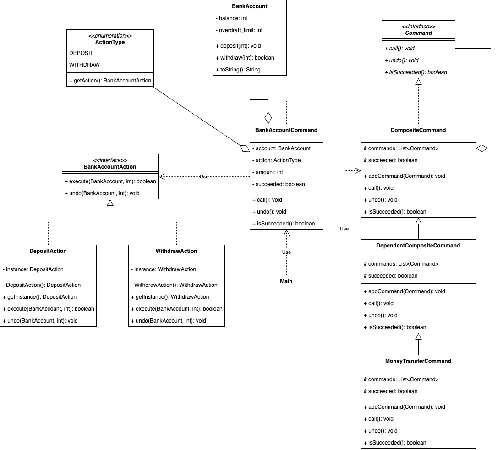

### Enum 타입을 사용하여 은행 계좌 시스템 리팩토링

`switch` 문을 없애고 더 확장성이 좋은 코드를 작성하기 위해
명령의 종류를 나타내는 Enum 타입인 **`ActionType` 이** **BankAccountAction** 클래스의 인스턴스를 반환하도록 구현했다.

```markdown
📦 [package commandPattern2]
   │
   ├── account
   │   ├── ActionType.java
   │   ├── BankAccount.java : 은행 계좌의 잔액을 관리하고 입금 및 출금 명령을 처리하는 은행 계좌 클래스
   │   ├── BankAccountAction.java : BankAccountCommand 에서 사용할 액션 클래스
   │   ├── BankAccountCommand.java : 은행 계좌에 대한 명령을 표현하는 클래스
   │   ├── DepositAction.java : 입금 액션을 나타내는 클래스
   │   ├── WithdrawAction.java : 출금 액션을 나타내는 클래스
   │   └── MoneyTransferCommand.java
   ├── command
   │   ├── Command.java : 명령을 나타내는 인터페이스. 이 인터페이스에 있는 메소드를 호출했을 때 구체적으로 무슨 일이 일어날지는 Command 인터페이스를 구현한 클래스가 결정한다.
   │   ├── CompositeCommand.java : 복수의 명령을 모은 명령을 표현하는 클래스
   │   └── DependentCompositeCommand.java : 복수의 명령을 모은 명령을 표현하는 클래스에 성공 여부에 따라 의존적으로 여러 명령을 실행하는 기능을 추가한 클래스
   └── Main

```


- BankAccountAction 인터페이스가 BankAccountCommand 클래스의 call, undo 에 각각 대응하는 메소드를 가지고 있다. 
- DepositAction, WithdrawAction 클래스가 진정한 구현이다.
  - BankAccountAction 인터페이스를 구현하는 클래스로서 execute, undo 라는 메소드를 사용하여 구현한다.

이렇게 하면 각 열거 상수(Action)를 해당 명령 객체로 매핑하기 때문에 열거 상수마다 다른 동작을 수행할 수 있다.

BankAccountCommand 클래스 안에서 위임을 사용한다.
BankAccountCommand 클래스의 인스턴스를 만드는 단계에서 인수로 넘어온 action 필드에는 구현의 인스턴스로 매핑된 열거 상수가 저장되어 있어, 아래와 같이 액션에 따라서 해당 명령을 처리한다.

```java
public class BankAccountCommand implements Command {
    @Override
    public void call() {
        // 액션에 따라서 해당 커맨드 객체를 실행
        succeeded = action.getAction().execute(account, amount);
    }
    
    @Override
    public void undo() {
        if (!succeeded) return;
        // 액션을 취소
        action.getAction().undo(account, amount);
    }
}

```

이렇게 하면 새로운 액션을 추가하거나 확장할 때 코드를 변경하지 않고도 쉽게 처리할 수 있다.

그리고 프로그램 안에서 Action 인스턴스가 여러 개 존재할 필요가 없기 때문에 Singleton 패턴으로 만들었다.