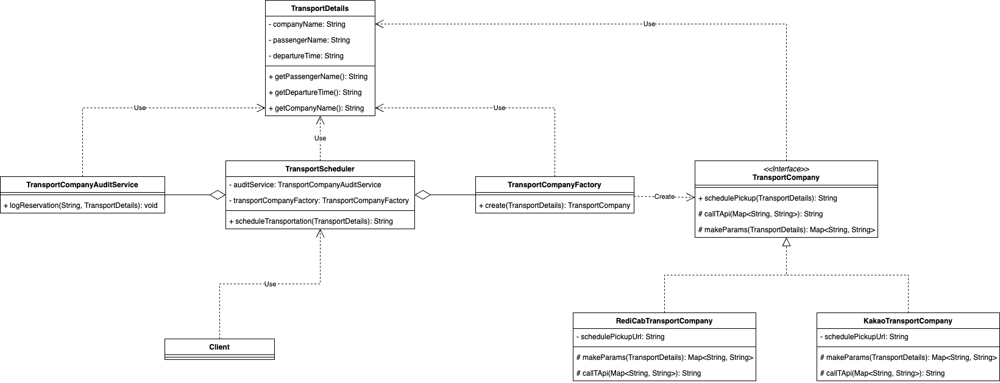

### 팩토리 패턴을 사용하여 택시 예약 서비스 리팩토링
객체 생성을 캡슐화하고 클라이언트 코드에서 직접 객체를 생성하는 대신 팩토리 메서드 또는 팩토리 클래스를 사용하여 객체를 생성하는 패턴

> 팩토리 패턴은 팩토리 클래스의 팩토리 메소드를 사용하여 하위 클래스의 인스턴스를 생성한다.

전략을 실제로 구현한 인스턴스를 생성하는 방법에 팩토리 패턴을 응용했다.
운수회사 모듈 생성을 통틀어 관장하는 팩토리 함수를 하나 만들어서 `switch` 문을 팩토리 메소드에 숨긴다.
팩토리가 있으면 아예 **TransportScheduler** 에 팩토리를 주입하기 때문에 **TransportScheduler** 메소드에서 switch 문을 피할 수 있다.

```markdown
📦 [package factoryPattern]
   ├── Client.java : 동작 테스트용 클래스
   ├── KakaoTransportCompany.java
   ├── RediCabTransportCompany.java
   ├── TransportCompany.java
   ├── TransportCompanyAuditService.java : 픽업 서비스 예약 내역을 로깅하는 집계 서비스를 나타내는 클래스
   ├── TransportCompanyFactory.java : 운송회사 모듈을 생성/반환하는 메소드 create 를 구현한 팩토리 클래스
   ├── TransportDetails.java
   └── TransportScheduler.java : 픽업 서비스를 스케줄링하는 클래스

```


이렇게 하면 위에서 **TransportScheduler** 코드가 어긴 개방/폐쇄 원칙도 준수하게 되는 이점도 있다.
운수회사 모듈을 새로 추가할 일이 생겨도 **TransportScheduler** 자체 코드는 전혀 건드리지 않은 채
전략 인스턴스 생성을 담당하는 팩토리 코드만 조금 손보면 얼마든지 확장할 수 있다.