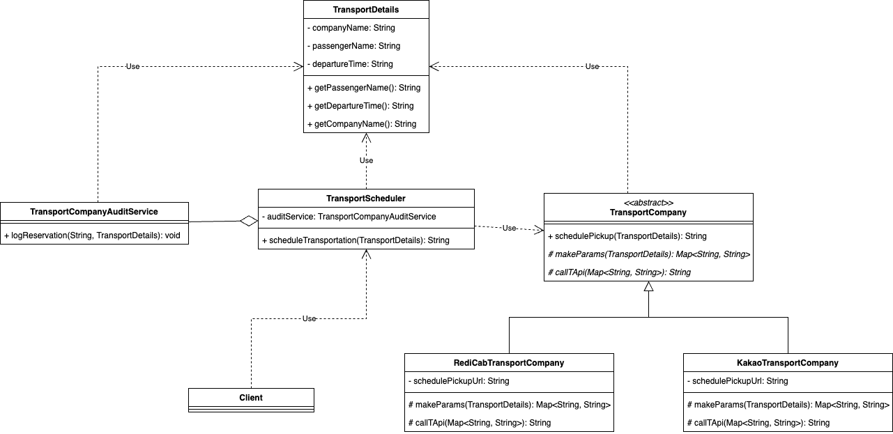

### 전략 패턴을 사용하여 간단한 택시 예약 서비스 구현
알고리즘을 정의하고 각 알고리즘을 캡슐화하여 실행 시에 알고리즘을 선택할 수 있게 하는 패턴

> 전략 패턴은 객체의 동작을 변경하기 위해 사용한다.
> 특정 작업을 수행하는 서로 다른 알고리즘을 분리하고, 런타임 시점에 알고리즘(전략)을 동적으로 지정할 수 있게 해준다.

#### 예) 이벤트에 참가하는 사람들을 대상으로 픽업 및 운송 서비스 예약을 관리한다.

**TransportScheduler.java**에서 픽업 서비스를 예약하는 메소드인 `scheduleTransportation`를 살펴보면

1) 입력한 운수회사명에 따라 어느 운수회사를 선택했는지 결정한다.
2) 해당 택시 운수회사 웹 서비스에 요청한다.
3) 요청 성공 시 집계 서비스로 탑승 기록을 남긴다.


> - 전략 패턴 없이 Switch 문을 사용하여 구현하면 참가자가 선택한 운수회사에 요청을 보내고, 집계 서비스에 기록하는 코드를 `TransportScheduler.scheduleTransportation` 메소드에 운수회사별로 다른 예약 로직을 모두 작성해야 한다. 이렇게 하면 코드가 길고, 한 가지 작업만 수행하지 않기 때문에 SRP(Single Responsibility Principle)를 위반한다.
> - 그리고 새 운수회사를 추가할 때 마다 코드를 변경해야 하기 때문에 OCP(Open Close Principle)를 위반한다.

이를 해결하기 위해 전략 패턴을 사용했다.


```markdown
📦 [package strategyPattern]
   ├── Client.java : 동작 테스트용 클래스
   ├── KakaoTransportCompany.java : 템플릿 메소드 정의에 사용된 추상 메소드를 구현하는 클래스
   ├── RediCabTransportCompany.java : 템플릿 메소드 정의에 사용된 추상 메소드를 구현하는 클래스
   ├── TransportCompany.java : 템플릿 메소드 schedulePickup 만 구현된 운송회사 모듈을 나타내는 추상 클래스
   ├── TransportCompanyAuditService.java
   ├── TransportDetails.java : 픽업에 필요한 정보를 나타내는 클래스
   └── TransportScheduler.java

🖼️ 
```

1) TransportCompany 인터페이스를 이용해서 다형성을 적용할 수 있는 구조를 만든다.
   - (before) 입력을 각 운수회사의 예약 서비스 구조에 맞추는 작업과 예약 서비스에 요청을 전송하는 작업을 수행하는 schedulePickup 메소드를 정의했다.
   ```java
   public class RediCabTransportCompany extends TransportCompany{
      @Override
       String schedulePickup(TransportDetails transportDetails) {
   
           Map<String, String> details = new HashMap<>();
           details.put("passenger", transportDetails.getPassengerName());
           details.put("pickUp", "컨퍼런스 센터");
           details.put("pickUpTime", transportDetails.getDepartureTime());
           details.put("dropOff", "공항");
           details.put("rateCode", "Conference");
   
           // 웹 서비스에 HTTP 요청을 전송한다.
   
           return "ABC-123-XYZ";
       }
   }
   ```
   - (after) 두 가지 작업을 다른 추상 메소드로 정의하고, schedulePickup 메소드는 픽업 서비스를 예약하는 일련의 단계를 정의한다.
   - 템플릿 메서드 역할을 하는 schedulePickup 메소드 내에서는 두 가지 추상 메서드인 makeParams와 callTApi를 호출한다.
   > Template Method 패턴: 특정 알고리즘의 구조를 정의하고 해당 알고리즘의 일부 단계를 서브클래스로 캡슐화하는 패턴  
   > 이렇게 하면 고정된 알고리즘 구조를 제공하며,
   > 알고리즘의 일부분을 서브클래스에서 재정의(오버라이딩)할 수 있으므로, 다양한 알고리즘의 구현을 지원하고 확장성을 높일 수 있다.
2) `TransportScheduler.scheduleTransportation` 메소드에서 switch 문을 통해 적절한 TransportCompany 구현 클래스를 인스턴스화 한다.

이렇게 하면 전략 패턴을 사용하여 다양한 운송회사의 동작을 캡슐화하고, 알고리즘을 쉽게 전환할 수 있다.
그리고 알고리즘이 있는 인터페이스 부분만 규정해 두고 프로그램에서 위임을 통해 알고리즘을 이용하기 때문에 동적 전환이 가능하다.

하지만 여전히 `TransportScheduler.scheduleTransportation` 메소드에서 1) 운수회사를 선택한 후 2) 전략 클래스의 인스턴스를 만들어야 한다.
