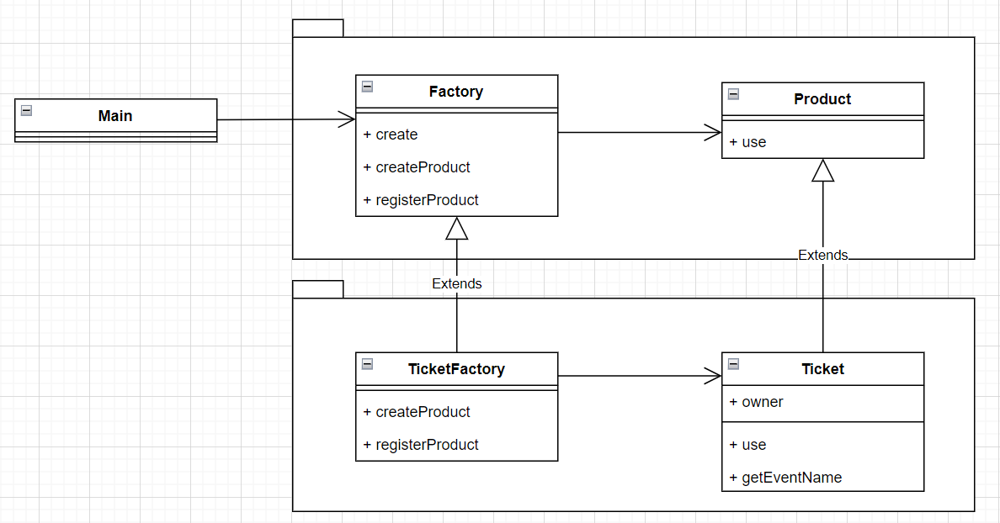

# 📝 Description
## Factory Pattern
팩토리 패턴의 중점은 인스턴스의 생성을 분리해서 캡슐화시키는 것입니다.

예제 2개를 만들어서 Factory Pattern의 필요성을 증명해보았습니다.

 

#### Example01. 이벤트 별 티켓 생성하기

   

_Simulation_ 새로운 이벤트가 추가된다면? 혹은 기존 이벤트가 삭제된다면?

 

#### Example02.케이크 가게의 케이크 주문 및 서빙 시뮬레이션

    

_Simulation_ 새로운 케이크 메뉴가 추가된다면? 혹은 기존 메뉴가 삭제된다면?
 
[Javadocs](docs/FactoryPattern/FactoryPatternDocumentation.html)

## Singleton Pattern

#### Example01. singleton 패턴으로 인스턴스 한 개 생성 보장하기
    

#### Example02. 초콜렛 보일러 한 개로 초콜렛 녹이기
     
   

_Simulation_ 싱글톤 패턴을 사용하지 않았다면?    
_Plus_ 동기화(Synchronization)를 고려해야 하는 이유
 
[Javadocs](docs/SingletonPattern/SingletonPatternDocumentation.html)

## State Pattern
#### Example01. 안전 관리 시스템
 

#### Example02. 뽑기 기계 시뮬레이션
 

_Simulation_ 새로운 새로운 기능이 추가된다면? 혹은 기존 기능이 삭제된다면?
[Javadocs](docs/StatePattern/StatePatternDocumentation.html)
